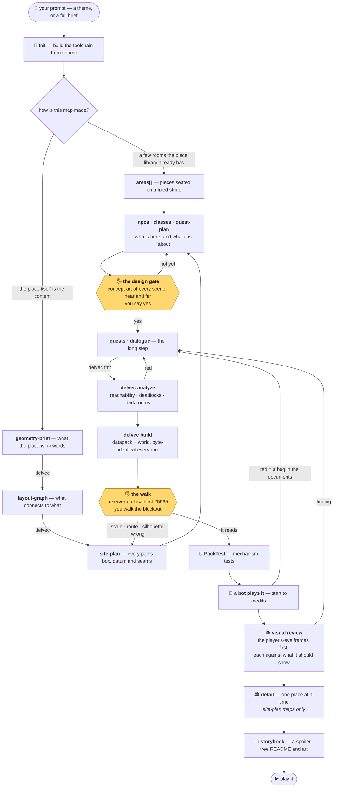

# Delvewright

*A factory that ships hand-crafted-feeling Minecraft dungeons — built by robots,
proven by robots, enjoyed by humans.*

[](https://crates.io/crates/delvec)
[](https://crates.io/crates/delvewright-dsl)
[](https://github.com/stellarfeline/delvewright-campaigns/pkgs/container/delve-nobodys-cave-island)

## What is this?

Delvewright is an automated production line for **delves**: self-contained,
story-driven Minecraft adventure maps for 1–4 friends. One evening, 2–3 hours,
adventure mode, pick a class at the door, zero grind. No mining for six hours to make
a pickaxe. No building a base. You walk in, the story happens *to you*, you walk out
with a tale. When the group wants another one, you make another one.

Each delve ships as a versioned container image. Running one is the whole install
guide:

```
docker run <the-delve>
```

…and there's a dungeon on `localhost`, waiting for your vanilla client. No mods. No
setup. No "everyone install these 14 things first."

## Not an app. Not a service. A workshop.

To be clear about what you're looking at: there is **no Delvewright server, no web
UI, no binary to install and click**. Delvewright is a workshop you operate
through [Claude Code](https://claude.com/claude-code) — that's the product form, by
design (see [ADR-0012](docs/adr/0012-product-form-claude-code-skill.md)).

You describe the delve you want — a one-line theme, or a full brief with specific
levels and plot — and an agent skill, `/new-delve`, does the rest:
writes the campaign as strict JSON, compiles it with `delvec`, runs the validation
gauntlet below, and hands you a container image. Claude Code is the engine room;
this repo is the machinery it operates.

The only thing that ever *runs* anywhere is the delve itself — a vanilla Minecraft
server in a box. Everything else is a build step.

## The `/new-delve` flow

Open Claude Code in the
**[campaigns repository](https://github.com/stellarfeline/delvewright-campaigns)** —
that is where the skill lives, and it is the only repository you clone; this one
is built from source beside it during Init. Type `/new-delve <your prompt>`, and
this happens.

The agent runs every box in the diagram except the two marked 🖐 — those are
**yours**. The line stops there and waits for you.



Three rules keep the loop honest: every red goes back to the **documents**
(nobody ever hand-edits compiler output), the campaign is **committed before
validation** (a crash can't lose it), and the finished delve must be
**rebuildable byte-identically from the committed documents alone** — the JSON is
the artifact of record, not the build.

And the rule behind the whole design: **if a machine can't finish the dungeon,
you never see it.** One QA hour per delve is the budget — the pipeline's job is
to make sure that hour goes on *is this fun?*, never on *is this broken?*

The procedure itself lives in the campaigns repository, at
[`.claude/skills/new-delve/SKILL.md`](https://github.com/stellarfeline/delvewright-campaigns/blob/main/.claude/skills/new-delve/SKILL.md) —
that is the repository you clone to build a delve, and it is the only one you
need. The page is written for the agent that executes it; you never have to read
it.

## The tools

One `cargo build --release --workspace` produces six binaries, plus
`delve-render` from its own workspace. What each is for:

| tool | the question it answers |
|---|---|
| `delvec` | the compiler. `validate` · `analyze` · `build` · `fmt` — plus `schema`, which prints the exact shape of every campaign document |
| `delvec viewer` | *what does this actually look like?* One self-contained web page you orbit, cut the roof off, and stand inside at eye height — every block drawn from the pinned version's own models |
| `delvec panorama` · `scene` · `snapshot` | frames to look at: the whole-map hero shot, the player's-eye review shots, quick drafts |
| `delvec contact-sheet` | *several candidate rooms, one slot* — all of them on one page to choose from |
| `delvec allocation` | *what box does this part get?* The extents, datum and seams a piece must answer |
| `delve-grammar` | *the library has no piece for this* — writes a new one from a rule program |
| `delve-admit` | *is this piece fit to ship?* — admits a prefab into the library |
| `delve-schem` | *I have a build from elsewhere* — converts an outside schematic |
| `delve-render` | GPU renders of one piece or a whole directory |
| `delve-harvest` | *what did the playtester write down?* — turns in-game notes into a report |
| `tools/refimg.py` | draws the concept art the design gate is confirmed on |
| `tools/staging-gate.py` | *is this build fit for a person to walk?* — it holds the only key to the play port |
| Chunky | every frame that has to *look* like Minecraft |

The complete inventory, flag by flag, is
[`docs/reference/tools.md`](docs/reference/tools.md); what the compiler does and
every diagnostic it can print is
[`docs/reference/compiler.md`](docs/reference/compiler.md).

## The house rules

Carved above the workshop door (the long versions live in [`docs/adr/`](docs/adr/README.md)):

- **The LLM writes stories, not commands.** All mcfunctions come from the compiler.
- **The player-facing server is pure vanilla** (pinned at 1.21.11, forever-ish).
  Mods exist only in the test rig — PackTest and friends never ship.
- **Determinism is sacred.** A delve build that differs by one byte between two runs
  is, by definition, a bug. CI checks this on every push.
- **CI is the judge.** Nothing merges red — and the repo is maintained by Claude Code
  agents working spec-by-spec, so the test suite is the adult in the room.
- **No grind.** If a quest ever says "collect 30 leather", something has gone
  terribly wrong.

## Want to see the current state?

With Docker and an accepted Minecraft EULA:

```sh
EULA=TRUE docker compose -f validation/compose.yaml -f validation/owner-play.yaml \
  --profile play up
```

…then join `localhost` from a vanilla 1.21.11 client. What you'll find is whatever
delve is currently on the validation rig — see [the roadmap](docs/ROADMAP.md) for
where the project stands.

## Getting the tool

`delvec` is the **delve creator**: one self-contained binary, no runtime
dependencies, holding everything you do to a campaign. It validates and
compiles campaign documents into a playable delve, analyses the result for
reachability, deadlocks and dark rooms, and renders what you have built so you
can look at it before you believe it. `--help` lists the subcommands.

It is the one tool you can install without a checkout. The rest of the table
above — and the renderer, which needs a GPU — are built from source, which is
the floor this project guarantees and never an afterthought: everything an
author needs is reachable from a clone.

```sh
cargo install delvec           # from crates.io
```

Or download a prebuilt archive for your platform from the
[latest release](https://github.com/stellarfeline/delvewright/releases/latest) —
Linux (x86-64 / arm64, statically linked), macOS (Apple Silicon / Intel) and
Windows (x86-64). Every archive's SHA-256 is published beside it in
`SHA256SUMS`; check it before you run the binary:

```sh
tar -xzf delvec-v<version>-<your-platform>.tar.gz
sha256sum --check --ignore-missing SHA256SUMS     # `shasum -a 256 -c` on macOS
./delvec --version
```

Building from a checkout of this repo (`cargo build -p delvec --bin delvec`)
gives you the same tool, and is the path to take if you are changing it.

## Map of the repo

| Path | What lives there |
|------|-----------------|
| [`CLAUDE.md`](CLAUDE.md) | The agent constitution — architecture, conventions, forbidden zones |
| [`docs/adr/`](docs/adr/README.md) | Why everything is the way it is (decision records) |
| [`docs/specs/`](docs/specs/README.md) | Owner-approved specs; no spec, no feature |
| [`docs/ROADMAP.md`](docs/ROADMAP.md) | Where this is going, milestone by milestone |
| `docs/reference/` | What the tools do today — [the compiler](docs/reference/compiler.md), [the tool inventory](docs/reference/tools.md), [how a piece is admitted](docs/reference/prefab-procedure.md) |
| `crates/` | Rust workspace: `dsl` (schemas + validation), `compiler` (`delvec`), `grammar`, `admit`, `schem`, `render`, `orchestrator` |
| `prefabs/` | Tileset generators (GPL) + docs; the `.nbt` room library itself lives in the content repo under `prefabs/` |
| `harness/` | The robot player (TypeScript + mineflayer) |
| `packtest/` | PackTest templates for mechanism assertions |
| `validation/` | Docker compose: the same rig for local checks, CI, and prod |

Generated campaigns and worlds do **not** live here — they ship separately as
releases/images with their own license.

## Licensing

- **Code**: [GPL-3.0-or-later](LICENSE).
- **Attributions**: every adopted library, ported algorithm, and design-shaping
  paper is recorded in [docs/ACKNOWLEDGEMENTS.md](docs/ACKNOWLEDGEMENTS.md).
- **Shipped delve content** (the campaigns/worlds you play): CC BY-SA 4.0.
- **Prefab assets**: original, CC0, CC BY, MIT, Apache-2.0, or GPL-compatible
  (ADR-0013) — provenance recorded, no exceptions, and never anything NC/ND or
  unlicensed. The library and its `LICENSE-ASSETS.md` live under `prefabs/` in the
  content repo
  ([`delvewright-campaigns`](https://github.com/stellarfeline/delvewright-campaigns)).

---

*Built by a planning agent and a small crew of worker agents, under the supervision
of one (1) human who would rather be playing the dungeon than debugging it. That's
the whole point.*
