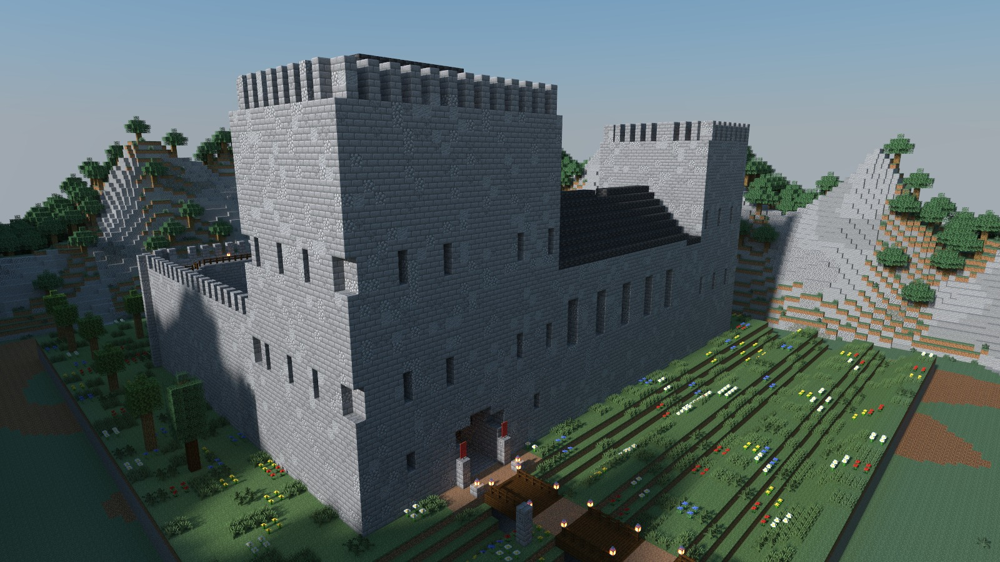
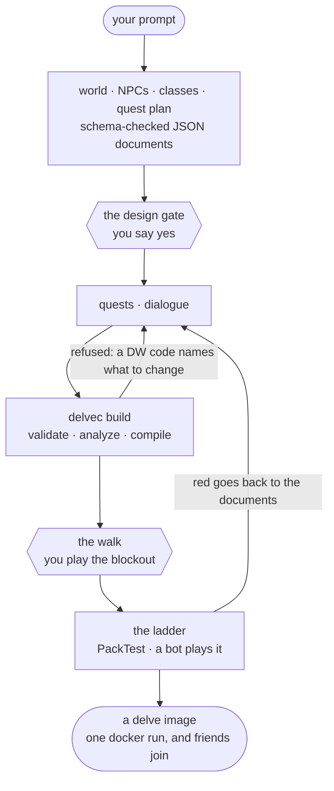
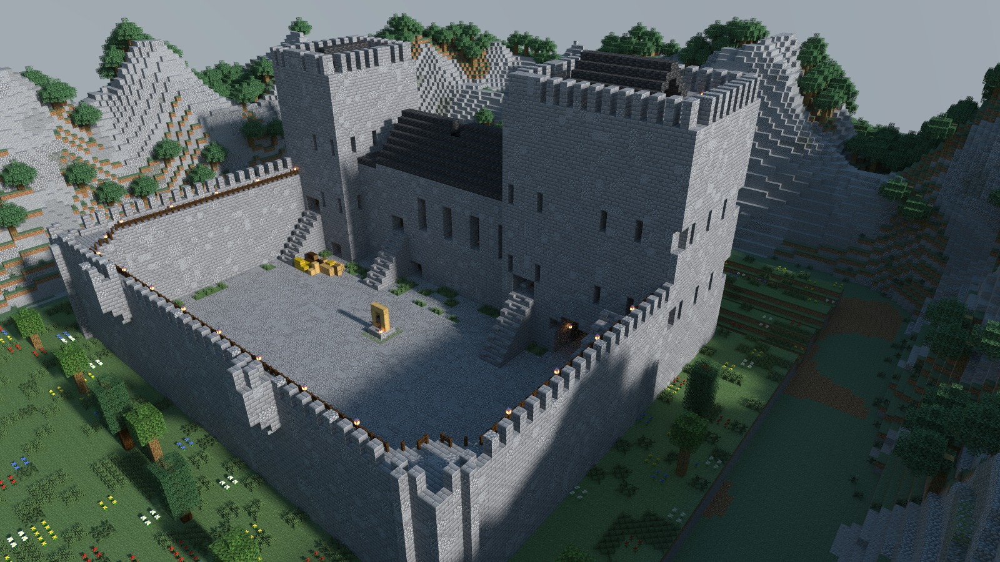

English · [简体中文](README.zh-CN.md)

# Delvewright



**Delvewright turns a creative prompt into a story-driven Minecraft adventure map for one to four friends, and proves by machine that it can be finished before it is handed over.**

It automates the tedium and the verification, not the design: it stops and waits for you to approve the design and to walk the build, and when it refuses something it names what to change instead of changing it.

**Walk this castle:** join `minecraft.stellarfeline.ca` from a Minecraft Java 1.21.11 client, and accept the resource-pack prompt when you join.

## Get started

In [Claude Code](https://claude.com/claude-code):

```
/plugin marketplace add stellarfeline/delvewright
/plugin install delvewright@delvewright
/delvewright:new-delve a guided tour of a real castle, nine rooms, no combat
```

The first run sets up its own toolchain. After that it asks you three things — where to get the Minecraft client jar, whether the design is right, and what you saw when you walked the build — and does the rest. What arrives is the campaign's documents, a spoiler-free storybook, and one command that builds, checks and serves the delve on `localhost:25565`. It needs git, Python 3.11 or newer, Java 21 or newer, and Docker with Compose v2 ([everything the first run checks](.claude/skills/delvewright/skills/new-delve/references/init.md)).

## How it works



The agent writes documents, never commands: every line of the datapack comes from the compiler, and nobody edits its output. The documents are the artifact of record — the same documents and the same seed rebuild the same bytes. [What each check printed for the castle above](#why-you-can-trust-it).

## Why you can trust it

Every rung below ran on **Doune Castle: A Guided Tour v1.0.0**, the castle in the picture, in its [release run](https://github.com/stellarfeline/delvewright-campaigns/actions/runs/34797937184) (`delvec` 1.5.0, engine revision `70eea629`, Minecraft 1.21.11). What each printed is quoted.

- **Static analysis.** Inside `delvec build`, before a byte is written: every document validates against its schema, every quest and dialogue path is walked, and a failure is a refusal with a named `DW` code. Doune: the build exited 0, having walked 2 state paths over 18 steps and examined 9 objectives, with one advisory — `DW0781`, the piece-mating check had nothing to judge, because the whole castle is one piece.
- **Every command checked.** Every emitted `.mcfunction` line is parsed against the pinned 1.21.11 command tree inside the same build. It prints no count.
- **PackTest.** The datapack's mechanisms, tested on a real server: `63 GAME TESTS COMPLETE IN 8.994 s` — `All 63 required tests passed :)`.
- **A bot plays it.** A mineflayer bot joins the shipped server and plays the critical path to the end: `critical path 'doune-castle-tour' PASSED (11 steps, 2 advisory finding(s))`. The two advisories say there is no combat and no death to test.
- **The server log.** `shipped server log is error-free.`
- **Determinism.** Same documents and same seed, byte-identical output. The published image carries its datapack's digest as a label, `datapack-sha256=dba45276efbaabea53ee261489921ead3925d2b3363cf0155ed0a8548b5666e0`, so anyone who rebuilds can compare. On every pull request to this repository, CI builds a generated campaign on Linux and on macOS and refuses if one byte differs.

What each rung proves, and what it does not: [what each gate actually proves](docs/reference/skill-workflow.md#4-what-each-gate-actually-proves).

## The map



A map is placed one of two ways. `areas[]` seats prefabs from a piece library, assembled by vanilla jigsaw from a compiler-controlled seed. A site plan goes whole-first — a geometry brief, a layout graph, then every part's box, datum and seams — and is walked as a blockout before any place is detailed. A piece the library does not have is written by the box-split grammar from a rule program: Doune is one area holding one such piece, the whole castle, 104 × 56 × 120 blocks. Light is placed while a room is designed, and the build refuses reachable floor that measures dark (`DW0210`). Every scene is rendered with Chunky and reviewed against the concept image it answers.

**[Inside the castle](docs/media/doune/README.md)** — the courtyard, the halls, the kitchen, the wall-walk.

Read on: [choosing a placement](.claude/skills/delvewright/skills/new-delve/references/placement.md) · [the map is planned before it is built](docs/adr/0022-the-map-is-planned-before-it-is-built.md) · [the grammar](docs/reference/grammar.md) · [admitting a piece](docs/reference/prefab-procedure.md) · [interior lighting](docs/reference/interior-lighting.md) · [visual review](.claude/skills/delvewright/skills/new-delve/references/visual-review.md)

## The story

A campaign is written in stages, each a schema-checked JSON document conditioned on the ones before it: the world, its NPCs, the classes and their gear, a quest plan, then quests and dialogue. Dialogue is written as branching options when the delve is made; nothing in a shipped delve calls a model. A campaign that declares story forks has every branch proven on its own path and played in its own fresh world. Player-facing text is written in English, and translations ship beside it and follow the player's client language.

Read on: [the DSL, stage by stage](docs/reference/compiler.md) · [writing the story](.claude/skills/delvewright/skills/new-delve/references/story.md) · [what a quest can do](.claude/skills/delvewright/skills/new-delve/references/quest-capabilities.md) · [branch-complete verification](docs/specs/spec-0025-branch-complete-verification.md) · [translation](docs/reference/i18n.md)

## Design decisions

- [Architecture decision records](docs/adr/README.md) — why everything is the way it is.
- [Specs](docs/specs/README.md) — one per feature, each with machine-checkable acceptance criteria.
- [The constitution](CLAUDE.md) — the rules every change to this repository obeys.
- [The gallery](gallery/README.md) — the engine's own campaign: one instance of every surface the DSL declares, built on every pull request.
- [The tool inventory](docs/reference/tools.md) · [the compiler reference](docs/reference/compiler.md) · [the roadmap](docs/ROADMAP.md)

| path | what lives there |
|---|---|
| [`crates/`](crates) | the Rust workspace: `dsl`, the campaign format, and `delvec`, the one binary every creator-facing capability is a subcommand of |
| [`.claude/skills/delvewright/`](.claude/skills/delvewright) | the Claude Code plugin and its `/new-delve` page |
| [`gallery/`](gallery) | the engine's own campaign |
| [`prefabs/`](prefabs) | tileset generators; the `.nbt` piece library lives in the [content repository](https://github.com/stellarfeline/delvewright-campaigns) |
| [`harness/`](harness) | the mineflayer bot |
| [`packtest/`](packtest) | PackTest templates |
| [`validation/`](validation) | the Docker Compose rig that local checks, CI and releases share |
| [`docs/`](docs) | decision records, specs and the live reference |

[](https://crates.io/crates/delvec) [](https://crates.io/crates/delvewright-dsl)

## Licence

Code: [GPL-3.0-or-later](LICENSE). Campaigns ship separately, from the [content repository](https://github.com/stellarfeline/delvewright-campaigns), under CC BY-SA 4.0. Every adopted library and ported algorithm: [acknowledgements](docs/ACKNOWLEDGEMENTS.md).

NOT AN OFFICIAL MINECRAFT PRODUCT. NOT APPROVED BY OR ASSOCIATED WITH MOJANG OR MICROSOFT.
