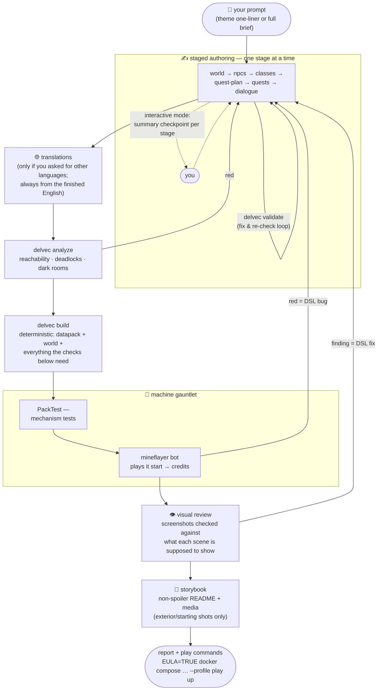

# Delvewright

*A factory that ships hand-crafted-feeling Minecraft dungeons — built by robots,
proven by robots, enjoyed by humans.*

## What is this?

Delvewright is an automated production line for **delves**: self-contained,
story-driven Minecraft adventure maps for 1–4 friends. One evening, 2–3 hours,
adventure mode, pick a class at the door, zero grind. No mining for six hours to make
a pickaxe. No building a base. You walk in, the story happens *to you*, you walk out
with a tale. When the group wants another one, you make another one.

Each delve ships as a versioned container image. Running one is the whole install
guide:

```
docker run <the-delve>
```

…and there's a dungeon on `localhost`, waiting for your vanilla client. No mods. No
setup. No "everyone install these 14 things first."

## Not an app. Not a service. A workshop.

To be clear about what you're looking at: there is **no Delvewright server, no web
UI, no binary to install and click**. This repo is a workshop, and you work in it
through [Claude Code](https://claude.com/claude-code) — that's the product form, by
design (see [ADR-0012](docs/adr/0012-product-form-claude-code-skill.md)).

You describe the delve you want — a one-line theme, or a full brief with specific
levels and plot — and an agent skill, `/new-delve`, does the rest:
writes the campaign as strict JSON, compiles it with `delvec`, runs the validation
gauntlet below, and hands you a container image. Claude Code is the engine room;
this repo is the machinery it operates.

The only thing that ever *runs* anywhere is the delve itself — a vanilla Minecraft
server in a box. Everything else is a build step.

## The `/new-delve` flow

Open Claude Code **in this repo** (the skill and the whole toolchain live here;
finished campaigns land in the separate content repo), type
`/new-delve <your prompt>`, and this happens:



Three rules keep the loop honest: every red goes back to the **DSL** (nobody ever
hand-edits compiler output), the campaign is **committed before validation** (a
crash can't lose it), and the finished delve must be **rebuildable byte-identically
from the committed documents alone** — the JSON is the artifact of record, not the
build.

## How it works (the assembly line)

```
  ✍️  LLM writes a campaign        — as strict JSON, six stages deep:
                                     world → NPCs → classes → quest plan
                                     → quests → dialogue (+ translations)
        │
        ▼
  ⚙️  delvec, a deterministic      — same input + same seed = byte-identical
      Rust compiler                  output, every single time. No exceptions.
        │                            The LLM NEVER writes a raw command; the
        ▼                            compiler writes ALL of them.
  📦  a datapack + a world         — rooms assembled from a curated prefab
                                     library, quests wired with scoreboards,
        │                            dialogs, and advancements
        ▼
  🤖  the gauntlet                 — a graph analyzer proves every quest is
                                     completable; a headless server must load it
        │                            with zero errors; PackTest checks the
        ▼                            mechanisms; then a mineflayer bot actually
  🧑‍🌾  humans                       PLAYS the whole thing, start to credits.
                                     Only then do humans get to see it.
```

The rule behind the whole design: **if a machine can't finish the dungeon, humans
never see it.** The maintainer budgets one QA hour per delve — the pipeline's job is
to make sure that hour is spent on "is this *fun*?", never on "is this *broken*?"

## The house rules

Carved above the workshop door (the long versions live in [`docs/adr/`](docs/adr/README.md)):

- **The LLM writes stories, not commands.** All mcfunctions come from the compiler.
- **The player-facing server is pure vanilla** (pinned at 1.21.11, forever-ish).
  Mods exist only in the test rig — PackTest and friends never ship.
- **Determinism is sacred.** A delve build that differs by one byte between two runs
  is, by definition, a bug. CI checks this on every push.
- **CI is the judge.** Nothing merges red — and the repo is maintained by Claude Code
  agents working spec-by-spec, so the test suite is the adult in the room.
- **No grind.** If a quest ever says "collect 30 leather", something has gone
  terribly wrong.

## Want to see the current state?

With Docker and an accepted Minecraft EULA:

```sh
EULA=TRUE docker compose -f validation/compose.yaml --profile play up
```

…then join `localhost` from a vanilla 1.21.11 client. What you'll find is whatever
delve is currently on the validation rig — see [the roadmap](docs/ROADMAP.md) for
where the project stands.

## Map of the repo

| Path | What lives there |
|------|-----------------|
| [`CLAUDE.md`](CLAUDE.md) | The agent constitution — architecture, conventions, forbidden zones |
| [`docs/adr/`](docs/adr/README.md) | Why everything is the way it is (decision records) |
| [`docs/specs/`](docs/specs/README.md) | Owner-approved specs; no spec, no feature |
| [`docs/ROADMAP.md`](docs/ROADMAP.md) | Where this is going, milestone by milestone |
| `crates/` | Rust workspace: `dsl` (schemas + validation), `compiler` (`delvec`), `orchestrator` |
| `prefabs/` | Tileset generators (GPL) + docs; the `.nbt` room library itself lives in the content repo under `prefabs/` |
| `harness/` | The robot player (TypeScript + mineflayer) |
| `packtest/` | PackTest templates for mechanism assertions |
| `validation/` | Docker compose: the same rig for local checks, CI, and prod |

Generated campaigns and worlds do **not** live here — they ship separately as
releases/images with their own license.

## Licensing

- **Code**: [GPL-3.0-or-later](LICENSE).
- **Attributions**: every adopted library, ported algorithm, and design-shaping
  paper is recorded in [docs/ACKNOWLEDGEMENTS.md](docs/ACKNOWLEDGEMENTS.md).
- **Shipped delve content** (the campaigns/worlds you play): CC BY-SA 4.0.
- **Prefab assets**: original, CC0, CC BY, MIT, Apache-2.0, or GPL-compatible
  (ADR-0013) — provenance recorded, no exceptions, and never anything NC/ND or
  unlicensed. The library and its `LICENSE-ASSETS.md` live under `prefabs/` in the
  content repo
  ([`delvewright-campaigns`](https://github.com/stellarfeline/delvewright-campaigns)).

---

*Built by a planning agent and a small crew of worker agents, under the supervision
of one (1) human who would rather be playing the dungeon than debugging it. That's
the whole point.*
