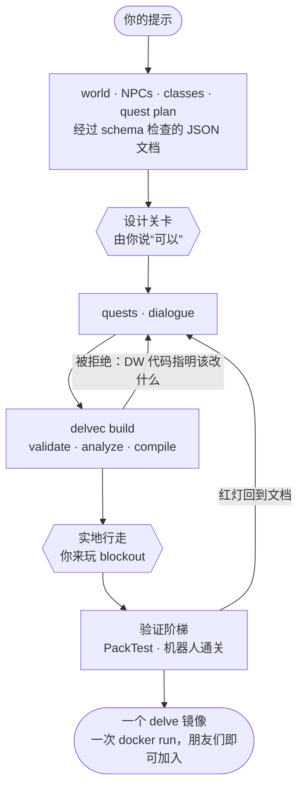

[English](README.md) · 简体中文

# Delvewright


**Delvewright 把一个创意提示变成一张供一到四位朋友游玩的、由故事驱动的 Minecraft 冒险地图，并在交付之前由机器证明它能被通关。**

它自动化的是繁琐的劳动和验证，而不是设计：它会停下来，等你认可设计、等你亲自走一遍构建出的地图；当它拒绝某样东西时，它会指明该改什么，而不是替你去改。

**走进这座城堡：** 用 Minecraft Java 1.21.11 客户端加入 `minecraft.stellarfeline.ca`，进入时接受资源包提示。

## 开始使用

在 [Claude Code](https://claude.com/claude-code) 中：

```
/plugin marketplace add stellarfeline/delvewright
/plugin install delvewright@delvewright
/delvewright:new-delve a guided tour of a real castle, nine rooms, no combat
```

第一次运行会自行搭建工具链。之后它只问你三件事——从哪里获取 Minecraft 客户端 jar、设计是否正确、以及你走一遍构建出的地图时看到了什么——其余的都由它完成。最终交付的是这个 campaign 的文档、一份不剧透的 storybook，以及一条命令：构建、检查并在 `localhost:25565` 上运行这个 delve。它需要 git、Python 3.11 或更新版本、Java 21 或更新版本，以及带 Compose v2 的 Docker（[第一次运行检查的全部内容](.claude/skills/delvewright/skills/new-delve/references/init.md)）。

## 工作原理



智能体只写文档，从不写命令：datapack 的每一行都来自编译器，没有人会编辑它的输出。文档是记录在案的产物——同样的文档加同样的种子，重新构建出同样的字节。[每项检查为上面这座城堡打印了什么](#为什么可以信任它)。

## 为什么可以信任它

下面每一级都在 **Doune Castle: A Guided Tour v1.0.0**——图中这座城堡——的 [release 运行](https://github.com/stellarfeline/delvewright-campaigns/actions/runs/34797937184)中跑过（`delvec` 1.5.0，引擎修订 `70eea629`，Minecraft 1.21.11）。每一级打印的内容原样引用。

- **静态分析。** 在 `delvec build` 内部、写出任何字节之前：每份文档都按其 schema 校验，每条任务与对话路径都被走一遍，失败即拒绝，并给出具名的 `DW` 代码。Doune：构建以 0 退出，走过了 2 条状态路径、共 18 步，检查了 9 个目标，有一条提示——`DW0781`，拼接检查无可判定，因为整座城堡是一个 piece。
- **每条命令都被检查。** 每一行生成的 `.mcfunction` 都在同一次构建中按固定版本 1.21.11 的命令树解析。它不打印计数。
- **PackTest。** 在真实服务器上测试 datapack 的各项机制：`63 GAME TESTS COMPLETE IN 8.994 s` —— `All 63 required tests passed :)`。
- **机器人通关。** 一个 mineflayer 机器人加入发布的服务器，把关键路径玩到结束：`critical path 'doune-castle-tour' PASSED (11 steps, 2 advisory finding(s))`。这两条提示说明没有战斗、也没有死亡可供测试。
- **服务器日志。** `shipped server log is error-free.`
- **确定性。** 同样的文档、同样的种子，输出逐字节相同。发布的镜像带有其 datapack 摘要作为标签，`datapack-sha256=dba45276efbaabea53ee261489921ead3925d2b3363cf0155ed0a8548b5666e0`，任何重新构建的人都可以比对。对本仓库的每个 pull request，CI 都会在 Linux 和 macOS 上构建一个生成的 campaign，只要有一个字节不同就拒绝。

每一级证明了什么、没有证明什么：[每道关卡实际证明了什么](docs/reference/skill-workflow.md#4-what-each-gate-actually-proves)。

## 地图


地图有两种摆放方式。`areas[]` 从 piece 库中取 prefab，由原版 jigsaw 按编译器控制的种子拼装。site plan 先整体后局部——先是 geometry brief，再是 layout graph，然后是每个部分的包围盒、基准面和接缝——并在任何地点细化之前先作为 blockout 走一遍。库里没有的 piece，由 box-split 语法根据规则程序写出：Doune 就是一个 area 里放着一个这样的 piece，整座城堡，104 × 56 × 120 格。光照在设计房间时就放好，构建会拒绝测得昏暗的可到达地面（`DW0210`）。每个场景都用 Chunky 渲染，并对照它所回应的概念图进行审查。

**[城堡内部](docs/media/doune/README.md)** —— 庭院、各个大厅、厨房、城墙步道。

延伸阅读：[选择摆放方式](.claude/skills/delvewright/skills/new-delve/references/placement.md) · [地图先规划后建造](docs/adr/0022-the-map-is-planned-before-it-is-built.md) · [语法](docs/reference/grammar.md) · [收录一个 piece](docs/reference/prefab-procedure.md) · [室内照明](docs/reference/interior-lighting.md) · [视觉审查](.claude/skills/delvewright/skills/new-delve/references/visual-review.md)

## 故事

campaign 分阶段编写，每个阶段都是一份经过 schema 检查、以前面各阶段为条件的 JSON 文档：世界、NPC、职业及其装备、任务规划，然后是任务和对话。对话在制作 delve 时就写成分支选项；发布的 delve 中没有任何东西调用模型。声明了故事分叉的 campaign，每条分支都沿自己的路径单独证明，并在各自全新的世界里玩一遍。面向玩家的文本用英文书写，译文随附发布，并跟随玩家客户端的语言。

延伸阅读：[DSL，逐阶段](docs/reference/compiler.md) · [编写故事](.claude/skills/delvewright/skills/new-delve/references/story.md) · [任务能做什么](.claude/skills/delvewright/skills/new-delve/references/quest-capabilities.md) · [分支完备验证](docs/specs/spec-0025-branch-complete-verification.md) · [翻译](docs/reference/i18n.md)

## 设计决策

- [架构决策记录](docs/adr/README.md) —— 一切为何如此。
- [规格](docs/specs/README.md) —— 每个功能一份，每份都带可机器检查的验收标准。
- [宪章](CLAUDE.md) —— 对本仓库的每次改动都要遵守的规则。
- [画廊](gallery/README.md) —— 引擎自己的 campaign：DSL 声明的每种能力各有一个实例，每个 pull request 都会构建。
- [工具清单](docs/reference/tools.md) · [编译器参考](docs/reference/compiler.md) · [路线图](docs/ROADMAP.md)

| 路径 | 内容 |
|---|---|
| [`crates/`](crates) | Rust 工作区：`dsl`，campaign 格式；以及 `delvec`，面向创作者的每项能力都是这一个二进制的子命令 |
| [`.claude/skills/delvewright/`](.claude/skills/delvewright) | Claude Code 插件及其 `/new-delve` 页面 |
| [`gallery/`](gallery) | 引擎自己的 campaign |
| [`prefabs/`](prefabs) | tileset 生成器；`.nbt` piece 库在[内容仓库](https://github.com/stellarfeline/delvewright-campaigns)里 |
| [`harness/`](harness) | mineflayer 机器人 |
| [`packtest/`](packtest) | PackTest 模板 |
| [`validation/`](validation) | 本地检查、CI 和发布共用的 Docker Compose 环境 |
| [`docs/`](docs) | 决策记录、规格和实时参考 |

[](https://crates.io/crates/delvec) [](https://crates.io/crates/delvewright-dsl)

## 许可

代码：[GPL-3.0-or-later](LICENSE)。campaign 从[内容仓库](https://github.com/stellarfeline/delvewright-campaigns)单独发布，采用 CC BY-SA 4.0。每个采用的库和移植的算法：[致谢](docs/ACKNOWLEDGEMENTS.md)。

NOT AN OFFICIAL MINECRAFT PRODUCT. NOT APPROVED BY OR ASSOCIATED WITH MOJANG OR MICROSOFT.（非 Minecraft 官方产品。未经 Mojang 或 Microsoft 批准，亦与其无关。）
