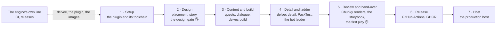
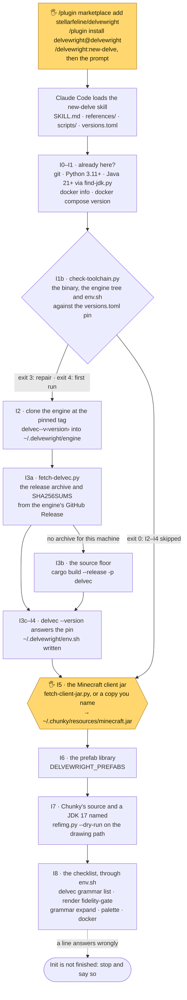
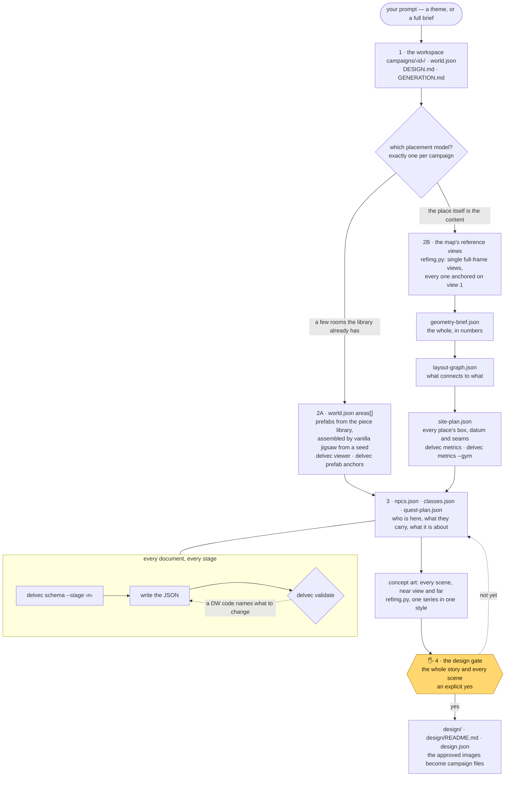
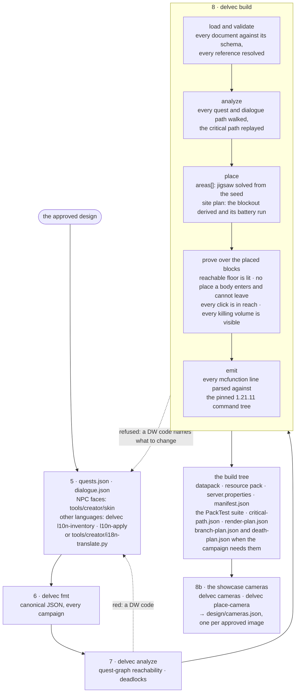
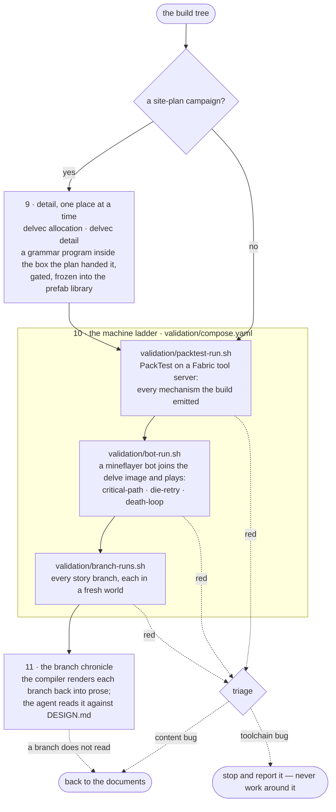
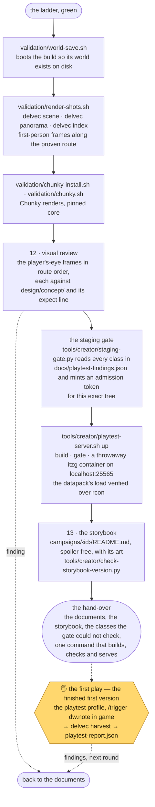
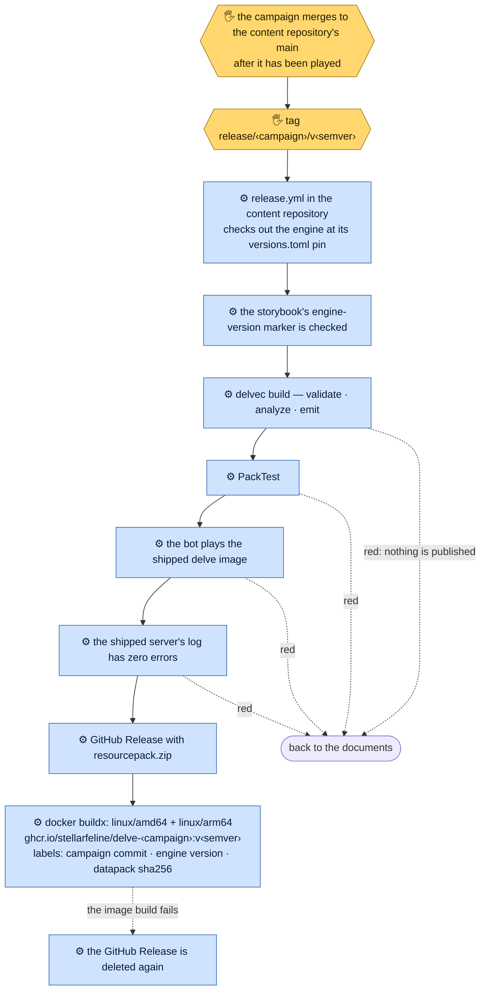
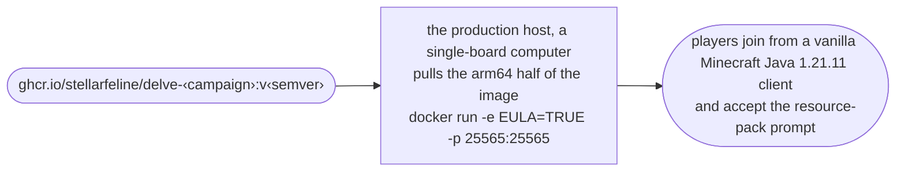
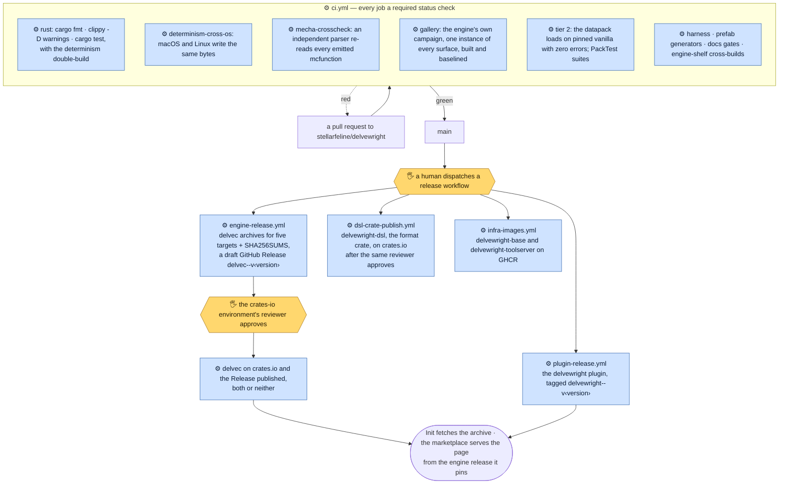

English · [简体中文](how-it-works.zh-CN.md)

# How Delvewright works, end to end

A delve travels from a prompt typed into Claude Code to a Minecraft server strangers can join. This page follows it the whole way, box by box, and names every tool that touches it. The front page has the short version; this is the long one.

The line runs in seven phases. The first five run on the creator's own machine, the last two in GitHub Actions and on the production host. Each phase has its own diagram below.

**Who does what.** In every diagram a plain box is the **agent**: Claude Code running the `/new-delve` skill. A yellow box marked 🖐 is **the human**: the line stops there and waits for an answer. A blue box marked ⚙ is **CI**: a GitHub Actions job. A dotted arrow is where a red goes back to. A red in a campaign goes back to its documents, or stops the line when the toolchain is at fault. Nobody edits the compiler's output.

## 1 · Setup — the plugin and its toolchain

The product is a Claude Code plugin ([ADR-0012](adr/0012-product-form-claude-code-skill.md)). Claude Code is the agent runtime; the plugin carries the `/new-delve` page ([`SKILL.md`](../.claude/skills/delvewright/skills/new-delve/SKILL.md)), its `references/`, its `scripts/` and a `versions.toml` that pins the one engine release the page was proven against. Every run starts with Init, which holds the toolchain in `~/.delvewright/` to that pin.

`delvec` is one Rust binary, the whole engine: compiler, renderers, grammar, prefab admission, all subcommands ([ADR-0023](adr/0023-creator-toolchain-as-decided.md)). It reaches a machine as a checksummed release archive (gnu Linux, macOS and Windows MSVC targets), through `cargo install delvec` from crates.io, or built from the pinned source tree when neither fits.

## 2 · Design — placement, story, and the design gate

A campaign is a directory of JSON documents, written in stages, each conditioned on the ones before it ([ADR-0002](adr/0002-staged-dsl.md)). The agent writes every one of them against the live schema, never from memory, and repairs each with `delvec validate` until only the refusals the next stage will answer are left.

The images at the gate are concept art drawn from the scene descriptions before any geometry exists, so what is approved is the design, not a build. `design.json` records the sky each approved image was drawn under, and the compiler later refuses a world whose skies disagree with it.

## 3 · Content and build — the compiler

After the yes comes the long step: quests and dialogue. Dialogue is written as branching options now, at generation time; nothing in a shipped delve calls a model. Then `delvec` turns the documents into a build tree ([ADR-0001](adr/0001-dsl-compiler-datapack.md)). The same documents and the same seed produce the same bytes on every machine ([ADR-0006](adr/0006-determinism.md)).

The build tree holds no world save and no server jar ([ADR-0010](adr/0010-oci-packaging.md)). The server is vanilla on a void world; the datapack places every prefab template on first boot ([ADR-0004](adr/0004-prefab-jigsaw.md)). A piece the library does not have is written by the box-split grammar from a rule program (`delvec grammar`), and every piece enters the library through `delvec prefab` admission. Every diagnostic the compiler can print is in [`compiler.md`](reference/compiler.md).

## 4 · Detail and ladder — the machines first

On a site-plan campaign the derived blockout is detailed first, one place at a time, so that everything after it — the machines and the human — judges the world that ships. The ladder then plays the delve on a real server, in the same Docker Compose rig CI and releases use ([ADR-0005](adr/0005-two-layer-validation.md)).

The bot's `die-retry` stage dies on purpose at every fight and walks back from the checkpoint; `death-loop` walks into every killing volume the build declares. Neither fights for real: whether a fight can be won is a question for a human.

## 5 · Review and hand-over

The first time a human plays the delve, it is the finished first version. Nothing is handed over until every machine has played it and the agent has reviewed what a player will see: the ladder green on the build that ships, then the player's-eye frames in route order.

The staging gate holds the only key to the play port: `validation/owner-play.yaml` is the one file that publishes 25565, and it refuses a tree with no token minted for it. A red gate lists the defect classes the player is not yet protected from, item by item, and the hand-over names each one, so the first play is never spent on one.

Drafts come from the CPU renderers (`delvec snapshot`, `delvec viewer`, `delvec contact-sheet`) and the GPU arm (`delvec render`); every picture that has to look like Minecraft is a Chunky render. The documents are the artifact of record: the finished delve rebuilds byte-identically from them, with no model in the loop.

## 6 · Release — GitHub Actions and GHCR

A campaign lives in the [content repository](https://github.com/stellarfeline/delvewright-campaigns), never in this one ([ADR-0007](adr/0007-monorepo-licensing.md)). It merges there once a human has played it, and a tag releases it. The release job builds it again and runs PackTest and the bot again, on the engine revision the content repository pins, and publishes nothing unless every rung is green.

The image is a pinned `itzg/minecraft-server` base (mirrored on GHCR by digest), the compiled datapack and the server config. The server jar is never baked in: the base fetches the pinned 1.21.11 jar at first boot, and the operator accepts the EULA at run time. No mods ship in it ([ADR-0003](adr/0003-vanilla-first.md)); PackTest and Fabric live only in the validation rig.

## 7 · Host — the production host

One `docker run` is a joinable dungeon. A host who leaves it running for strangers adds `-e DELVE_RESET_WHEN_EMPTY=90`, and the world is rebuilt from the image once nobody has been online for that many seconds.

## The engine's own line

Everything above runs on releases of this repository. Changes reach `main` by pull request, CI is the sole arbiter ([ADR-0008](adr/0008-ci-as-arbiter.md)), and each of the three things the engine releases is released by a human dispatching its workflow ([ADR-0028](adr/0028-three-things-released-by-name.md)).

## The stack

| Piece | What it is | Where it acts | Who runs it |
|---|---|---|---|
| [Claude Code](https://claude.com/claude-code) | the agent runtime | every phase on the creator's machine | the agent |
| [`/new-delve`](../.claude/skills/delvewright/skills/new-delve/SKILL.md) | the skill page: Init and thirteen steps, with a reference file per step | 1–5 | the agent |
| staged JSON documents | `world` · `npcs` · `classes` · `quest-plan` · `quests` · `dialogue`, plus `geometry-brief` · `layout-graph` · `site-plan` · `detail-plan` · `design` | 2–5 | the agent writes them |
| `delvec` | the Rust engine, one binary: `schema` · `validate` · `analyze` · `build` · `fmt` · `metrics` · `allocation` · `detail` · `l10n-inventory` · `l10n-apply` | 2–4 | the agent |
| `delvec` render surface | `snapshot` · `blocking-chart` · `viewer` · `palette` · `scene` · `panorama` · `cameras` · `place-camera` · `contact-sheet` · `index` (CPU), `render` (GPU, through Nucleation and wgpu) | 3, 5 | the agent |
| `delvec` pieces | `grammar` (the box-split grammar) · `prefab` (admission, jigsaw sockets, anchors, lighting) · `schem` (outside schematics) | 2, 4 | the agent |
| `delvec harvest` · `calibrate` | in-game notes and hand-placed shots, turned back into reports and patches | 5 | the agent, after a human plays |
| `tools/creator/refimg.py` | concept art from a configured image provider | 2 | the agent; the human judges it |
| `tools/creator/staging-gate.py` + `docs/playtest-findings.json` | the gate on the findings ledger; the only key to the play port | 5 | the agent |
| `tools/creator/playtest-server.sh` | a throwaway local itzg server on `localhost:25565` | 5 | the agent starts it; the human plays |
| `tools/creator/skin`, `i18n-translate.py`, `block-appearance.py`, `refscore.py` | NPC faces, translation, block choice by appearance, candidate scoring | 3, 5 | the agent |
| `tools/creator/check-storybook-version.py` | the storybook's engine-version marker | 5, 6 | the agent and the campaign's release |
| `validation/` Docker Compose rig | `compose.yaml` with the `play`, `playtest`, `validate` and `packtest` profiles; `owner-play.yaml` | 4–6 | the agent and CI |
| PackTest on Fabric | mechanism tests on a tool server; never in a shipped delve | 4, 6 | the agent and CI |
| `harness/` | the mineflayer bot (TypeScript): critical path, die-retry, death-loop, branch runs | 4, 6 | the agent and CI |
| Chunky | every picture that has to look like Minecraft | 5 | the agent |
| GitHub Actions | `ci.yml`, `engine-release.yml`, `dsl-crate-publish.yml`, `plugin-release.yml`, `infra-images.yml`, `gpu-probe.yml` here; `release.yml` in the content repository | engine line, 6 | CI, dispatched by a human |
| GHCR | multi-arch delve images, the mirrored server base and the tool server | 6, 7 | CI |
| crates.io and GitHub Releases | `delvec` and `delvewright-dsl`; the per-platform archives | engine line, 1 | CI |
| the production host | a single-board computer that runs the delve image | 7 | the operator |

Every tool, flag by flag: [`reference/tools.md`](reference/tools.md). What the compiler does and every diagnostic it can print: [`reference/compiler.md`](reference/compiler.md). What each gate proves, and what it does not: [`reference/skill-workflow.md`](reference/skill-workflow.md#4-what-each-gate-actually-proves).
