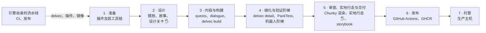
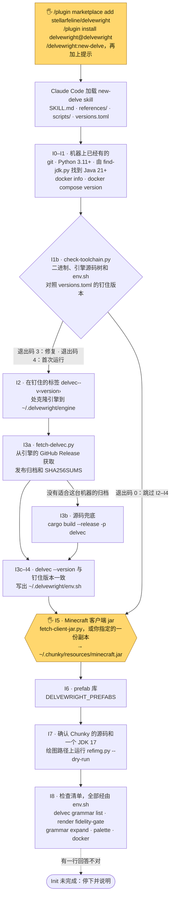
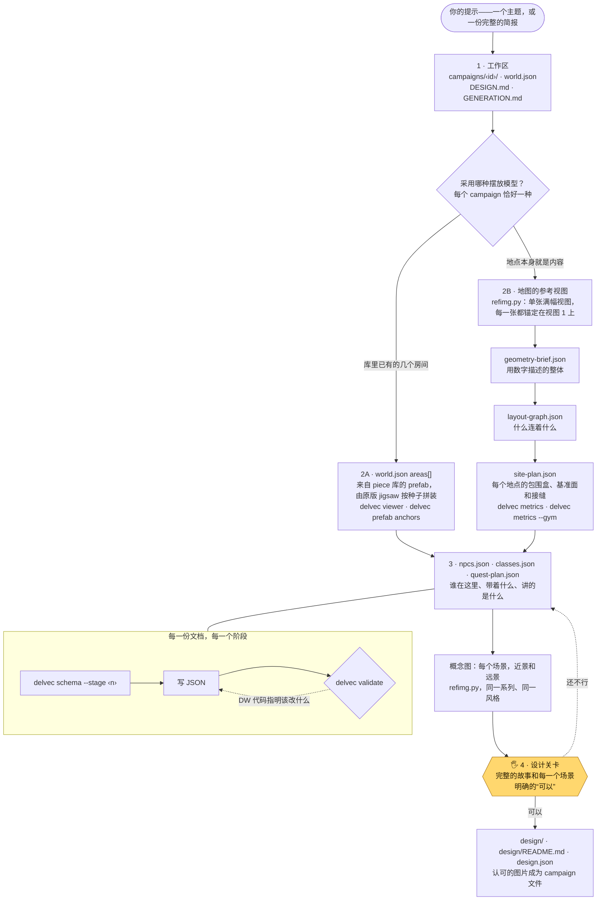
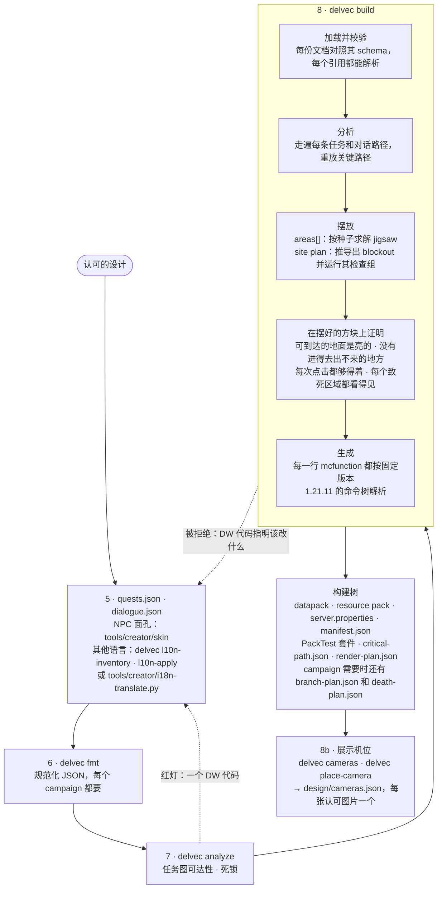
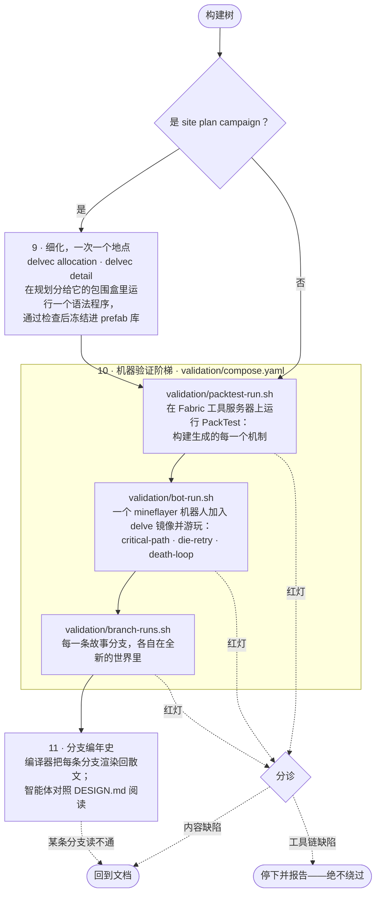
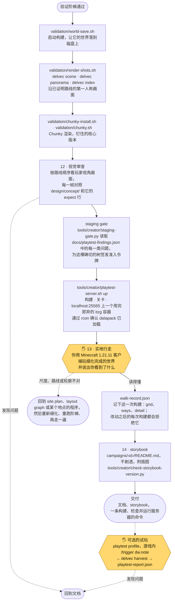
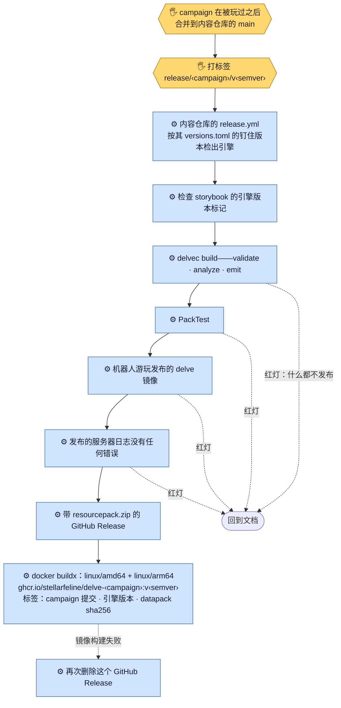
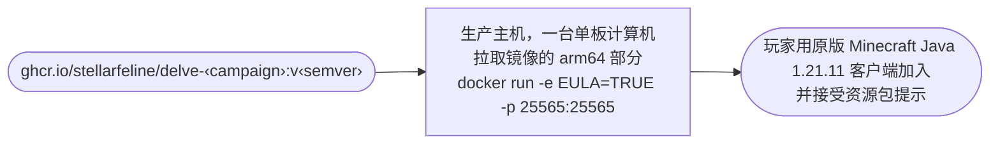
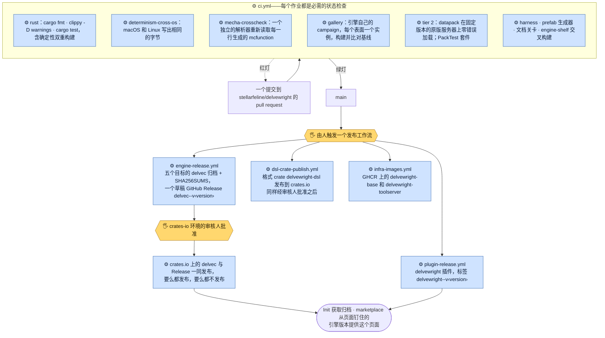

[English](how-it-works.md) · 简体中文

# Delvewright 从头到尾如何运作

一个 delve 从在 Claude Code 里输入的一句提示出发，一直走到一台陌生人也能加入的 Minecraft 服务器。本页沿途逐个方框跟随它，并点名每一个经手的工具。首页给出的是简短版本，这里是完整版本。

整条流水线分七个阶段。前五个在创作者自己的机器上运行，后两个在 GitHub Actions 和生产主机上运行。每个阶段在下面都有自己的图。

**谁做什么。** 每张图里，普通方框是**智能体**：运行 `/new-delve` skill 的 Claude Code。标有 🖐 的黄色方框是**人**：流水线在那里停下，等待回答。标有 ⚙ 的蓝色方框是 **CI**：一个 GitHub Actions 作业。虚线箭头表示红灯退回到哪里。campaign 中的红灯退回到它的文档；如果是工具链的问题，则整条线停下。没有人编辑编译器的输出。

## 1 · 准备——插件及其工具链

产品形态是一个 Claude Code 插件（[ADR-0012](adr/0012-product-form-claude-code-skill.md)）。Claude Code 是智能体的运行时；插件携带 `/new-delve` 页面（[`SKILL.md`](../.claude/skills/delvewright/skills/new-delve/SKILL.md)）、它的 `references/`、`scripts/`，以及一个 `versions.toml`，钉住这个页面经过验证的那一个引擎版本。每次运行都从 Init 开始，Init 让 `~/.delvewright/` 中的工具链与这个钉住的版本保持一致。

`delvec` 是一个 Rust 二进制，就是整个引擎：编译器、渲染器、语法、prefab 收录，全都是它的子命令（[ADR-0023](adr/0023-creator-toolchain-as-decided.md)）。它到达一台机器的方式有三种：一个带校验和的发布归档（gnu Linux、macOS 和 Windows MSVC 目标），通过 crates.io 的 `cargo install delvec`，或者在两者都不适用时从钉住的源码树构建。

## 2 · 设计——摆放、故事与设计关卡

一个 campaign 是一个由 JSON 文档组成的目录，分阶段写成，每一份都以前面的文档为条件（[ADR-0002](adr/0002-staged-dsl.md)）。智能体对照实时的 schema 写每一份文档，从不凭记忆，并用 `delvec validate` 逐份修复，直到只剩下下一阶段会回答的那些拒绝。

设计关卡上的图片是在任何几何体存在之前、根据场景描述画出的概念图，所以被认可的是设计，而不是某次构建。`design.json` 记录每张认可图片绘制时的天空，之后编译器会拒绝天空与之不符的世界。

## 3 · 内容与构建——编译器

得到“可以”之后是最长的一步：quests 和 dialogue。对话在此刻、生成时就写成分支选项；发布的 delve 里没有任何东西调用模型。然后 `delvec` 把文档变成一棵构建树（[ADR-0001](adr/0001-dsl-compiler-datapack.md)）。同样的文档加同样的种子，在任何机器上都产出同样的字节（[ADR-0006](adr/0006-determinism.md)）。

构建树里没有世界存档，也没有服务器 jar（[ADR-0010](adr/0010-oci-packaging.md)）。服务器是虚空世界上的原版服务器；datapack 在首次启动时放置每一个 prefab 模板（[ADR-0004](adr/0004-prefab-jigsaw.md)）。库里没有的 piece，由 box-split 语法根据规则程序写出（`delvec grammar`），每个 piece 都经过 `delvec prefab` 收录才进入库。编译器可能打印的每一条诊断都在 [`compiler.md`](reference/compiler.md) 里。

## 4 · 细化与验证阶梯——先让机器过一遍

在 site plan campaign 上，先把推导出来的 blockout 一个地点一个地点地细化，这样之后的一切——机器也好，人也好——检验的都是最终发布的那个世界。随后验证阶梯在真实服务器上玩这个 delve，所用的 Docker Compose 装置与 CI 和发布所用的相同（[ADR-0005](adr/0005-two-layer-validation.md)）。

机器人的 `die-retry` 阶段在每场战斗中故意死亡，再从检查点走回来；`death-loop` 走进构建声明的每一个致死区域。两者都不真正战斗：一场战斗能不能打赢，是留给人的问题。

## 5 · 审查、实地行走与交付

人最后才走，走的是细化完成的世界，所有机器都已经先玩过一遍：站在 blockout 里，几乎看不出什么。代价也摆在明面上：实地行走时发现的路线问题要在细化之后才修，所以除了改 site plan 或 layout graph，还要把细化重做一遍。

staging gate 握着游玩端口唯一的钥匙：`validation/owner-play.yaml` 是唯一发布 25565 端口的文件，它拒绝启动没有为之签发令牌的构建树。红色的关卡结果逐项列出行走者尚未受到保护的缺陷类别，这样实地行走的时间就不会花在这些问题上。

草图来自 CPU 渲染器（`delvec snapshot`、`delvec viewer`、`delvec contact-sheet`）和 GPU 渲染（`delvec render`）；每一张必须看起来像 Minecraft 的图都是 Chunky 渲染的。文档是记录在案的产物：完成的 delve 能从它们逐字节相同地重建出来，整个过程不需要模型。

## 6 · 发布——GitHub Actions 与 GHCR

campaign 存放在[内容仓库](https://github.com/stellarfeline/delvewright-campaigns)里，从不放在本仓库（[ADR-0007](adr/0007-monorepo-licensing.md)）。人玩过之后它才合并进去，再由一个标签发布。发布作业在内容仓库钉住的引擎修订上重新构建，再跑一遍 PackTest 和机器人，只要有一级不是绿灯就什么都不发布。

镜像由一个钉住的 `itzg/minecraft-server` 基础镜像（按摘要镜像到 GHCR）、编译出的 datapack 和服务器配置组成。服务器 jar 从不打包进去：基础镜像在首次启动时获取钉住的 1.21.11 jar，运营者在运行时接受 EULA。镜像里不带任何 mod（[ADR-0003](adr/0003-vanilla-first.md)）；PackTest 和 Fabric 只存在于验证装置中。

## 7 · 托管——生产主机

一次 `docker run` 就是一个可加入的地下城。让它为陌生人长期运行的主机加上 `-e DELVE_RESET_WHEN_EMPTY=90`，在无人在线达到这么多秒之后，世界就会从镜像重建。

## 引擎自身的流水线

上面的一切都运行在本仓库的发布版本之上。改动通过 pull request 进入 `main`，CI 是唯一的裁决者（[ADR-0008](adr/0008-ci-as-arbiter.md)），引擎发布的三样东西各自由人触发其工作流来发布（[ADR-0028](adr/0028-three-things-released-by-name.md)）。

## 技术栈

| 组成部分 | 它是什么 | 作用于哪个阶段 | 由谁运行 |
|---|---|---|---|
| [Claude Code](https://claude.com/claude-code) | 智能体的运行时 | 创作者机器上的每个阶段 | 智能体 |
| [`/new-delve`](../.claude/skills/delvewright/skills/new-delve/SKILL.md) | skill 页面：Init 加十四个步骤，每步一个参考文件 | 1–5 | 智能体 |
| 分阶段的 JSON 文档 | `world` · `npcs` · `classes` · `quest-plan` · `quests` · `dialogue`，以及 `geometry-brief` · `layout-graph` · `site-plan` · `detail-plan` · `design` · `walk-record` | 2–5 | 由智能体编写 |
| `delvec` | Rust 引擎，一个二进制：`schema` · `validate` · `analyze` · `build` · `fmt` · `metrics` · `allocation` · `detail` · `l10n-inventory` · `l10n-apply` | 2–4 | 智能体 |
| `delvec` 渲染表面 | `snapshot` · `blocking-chart` · `viewer` · `palette` · `scene` · `panorama` · `cameras` · `place-camera` · `contact-sheet` · `index`（CPU），`render`（GPU，经由 Nucleation 和 wgpu） | 3、5 | 智能体 |
| `delvec` 构件 | `grammar`（box-split 语法） · `prefab`（收录、jigsaw 接口、锚点、照明） · `schem`（外部 schematic） | 2、4 | 智能体 |
| `delvec harvest` · `calibrate` | 把游戏内笔记和手动放置的镜头转回报告和补丁 | 5 | 人玩过之后由智能体运行 |
| `tools/creator/refimg.py` | 由配置的图像服务生成概念图 | 2 | 智能体；由人评判 |
| `tools/creator/staging-gate.py` + `docs/playtest-findings.json` | 基于问题台账的关卡；游玩端口唯一的钥匙 | 5 | 智能体 |
| `tools/creator/playtest-server.sh` | `localhost:25565` 上一个用完即弃的本地 itzg 服务器 | 5 | 智能体启动；人来走 |
| `tools/creator/skin`、`i18n-translate.py`、`block-appearance.py`、`refscore.py` | NPC 面孔、翻译、按外观选方块、候选评分 | 3、5 | 智能体 |
| `tools/creator/check-storybook-version.py` | storybook 的引擎版本标记 | 5、6 | 智能体和该战役的发布流程 |
| `validation/` Docker Compose 装置 | 带 `play`、`playtest`、`validate`、`packtest` profile 的 `compose.yaml`；`owner-play.yaml` | 4–6 | 智能体和 CI |
| Fabric 上的 PackTest | 在工具服务器上的机制测试；从不出现在发布的 delve 里 | 4、6 | 智能体和 CI |
| `harness/` | mineflayer 机器人（TypeScript）：关键路径、die-retry、death-loop、分支运行 | 4、6 | 智能体和 CI |
| Chunky | 每一张必须看起来像 Minecraft 的图 | 5 | 智能体 |
| GitHub Actions | 本仓库的 `ci.yml`、`engine-release.yml`、`dsl-crate-publish.yml`、`plugin-release.yml`、`infra-images.yml`、`gpu-probe.yml`；内容仓库的 `release.yml` | 引擎流水线、6 | CI，由人触发 |
| GHCR | 多架构 delve 镜像、镜像的服务器基础镜像和工具服务器 | 6、7 | CI |
| crates.io 与 GitHub Releases | `delvec` 和 `delvewright-dsl`；各平台的归档 | 引擎流水线、1 | CI |
| 生产主机 | 运行 delve 镜像的一台单板计算机 | 7 | 运营者 |

每个工具的每个参数：[`reference/tools.md`](reference/tools.md)。编译器做什么、可能打印的每一条诊断：[`reference/compiler.md`](reference/compiler.md)。每道关卡证明了什么、没有证明什么：[`reference/skill-workflow.md`](reference/skill-workflow.md#4-what-each-gate-actually-proves)。
