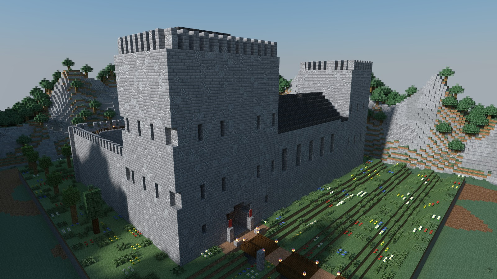

English · [简体中文](README.zh-CN.md)

# Campaigns built with Delvewright

Every delve on this page was written through Delvewright and played to its end by a bot before it was handed over. Each picture is a render of the built map; follow a title for one picture of each place, in the order a party reaches them. [Back to the front page](../../README.md).

## [Vesperhold](vesperhold/README.md)

A souls-like castle for one to four hired blades, about an hour long. The bell of a Gothic hold on a crag has been silent for ten years, its gates are shut, and its guards keep a watch they no longer understand; you climb from a fire at the foot of the causeway to the throne, fighting all the way. Four classes to choose from.

## [The Treehouse Camp](the-treehouse-camp/README.md)

A gentle walk and climb for one to four guests, under half an hour, with nothing hostile in it. A forest clan lives in houses built round four giant trees, joined by rope bridges and rope ladders; on Lantern Night you fetch a lantern and its oil from two houses, carry it up the tallest tree, and watch the whole camp light up below you.

## [Doune Castle: A Guided Tour](doune/README.md)

A walk through a real fourteenth-century Scottish castle with a guide who knows it, about thirty-five minutes, no combat. Nine stops from the gatehouse to the wall-walk, and you may wander off the tour from the first minute.

---

These are renders of original content built by the engine, shown with Minecraft's textures, and shared under [Mojang's usage guidelines](https://www.minecraft.net/en-us/usage-guidelines) for screenshots.
