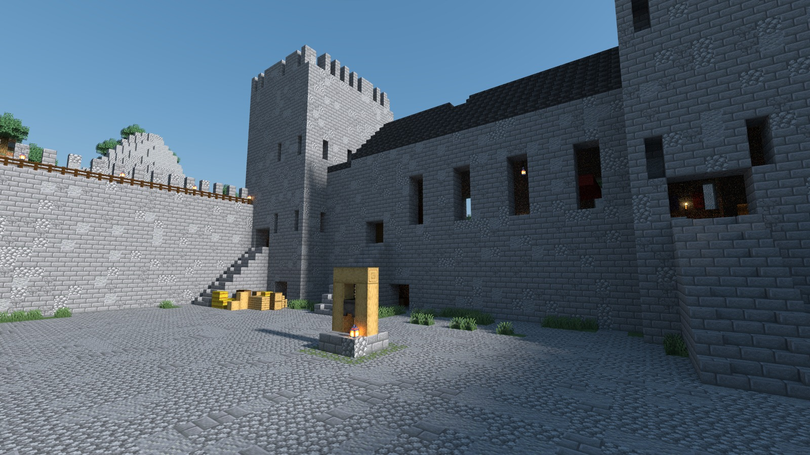
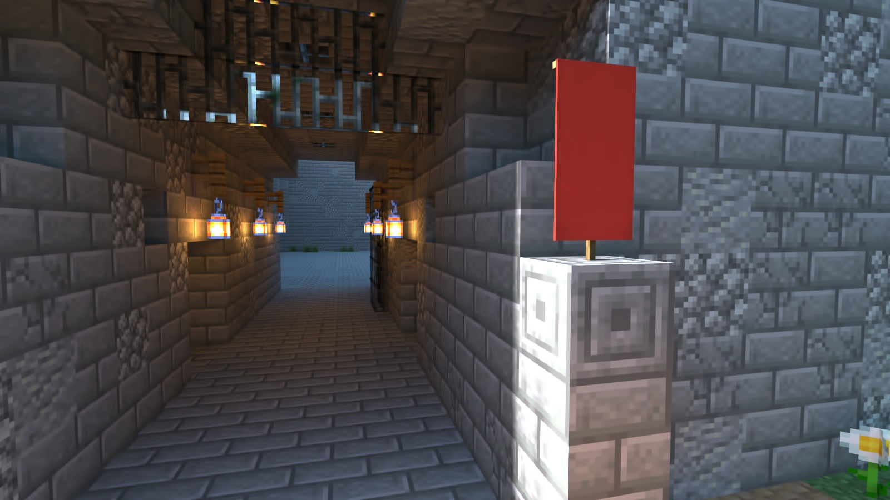
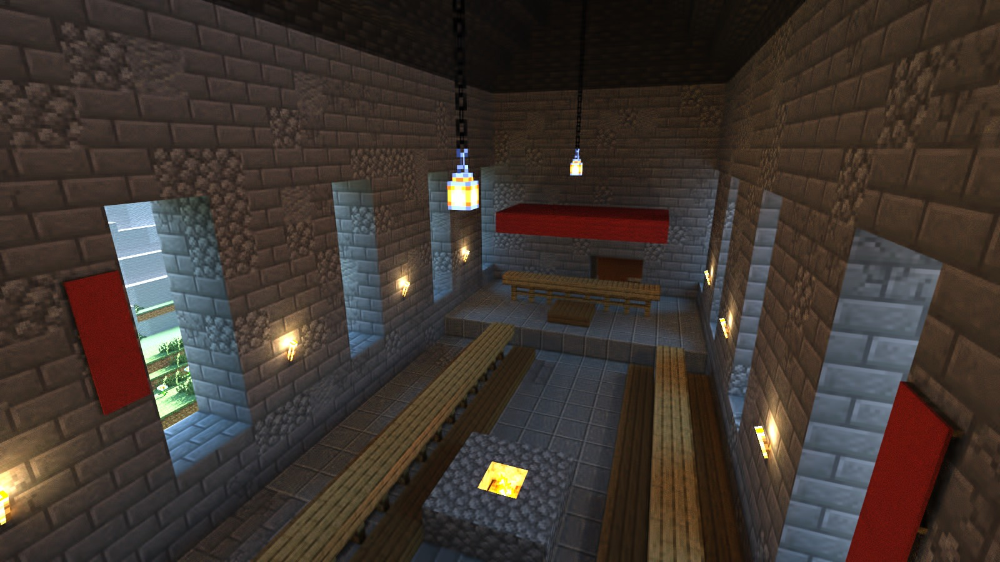
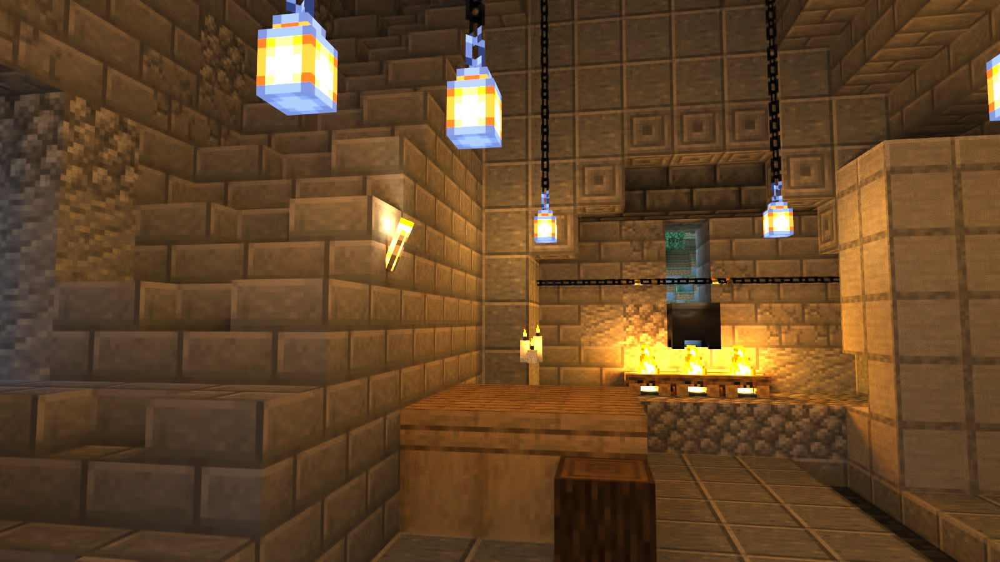
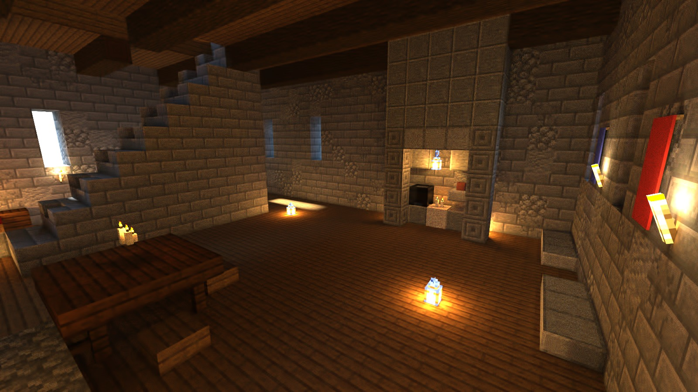
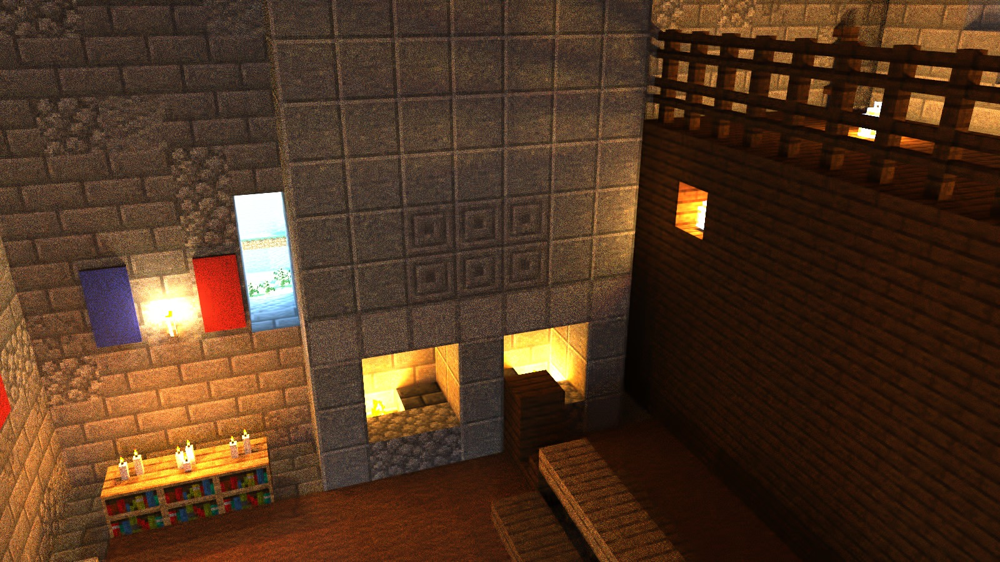
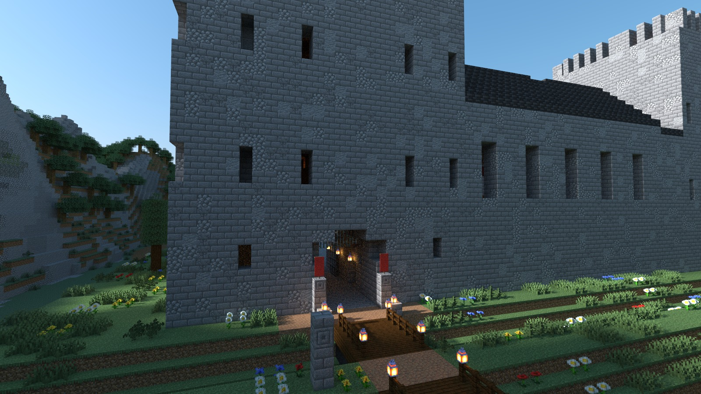
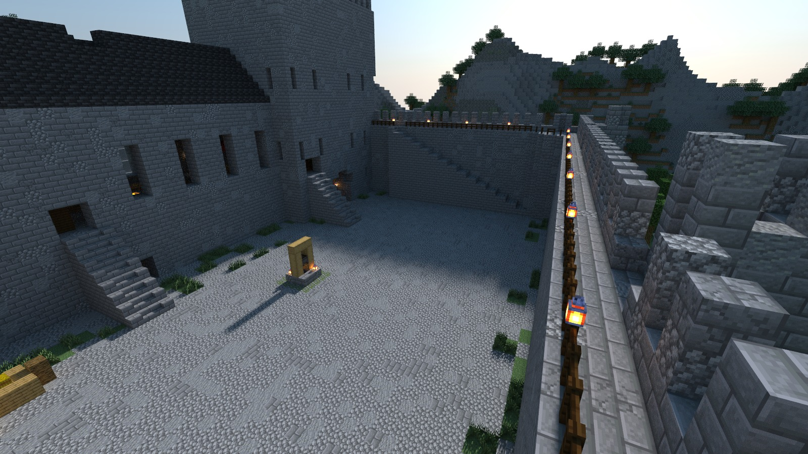
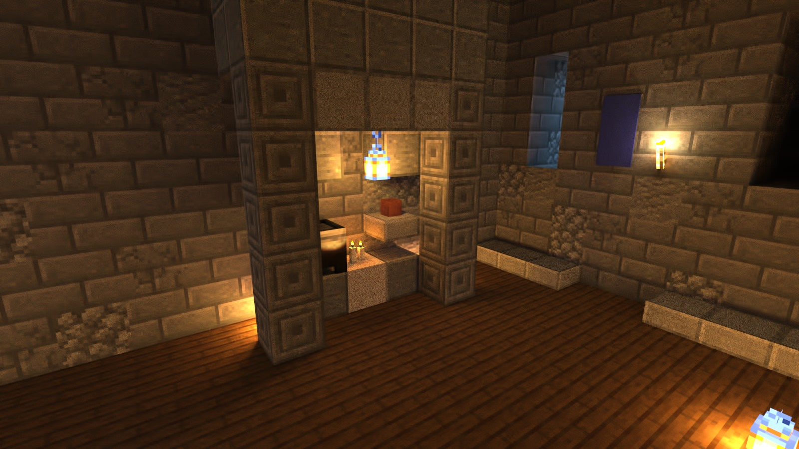

# Inside Doune Castle

Renders of **Doune Castle: A Guided Tour**, a delve built with Delvewright. [Back to the front page](../../../README.md).

The courtyard from the ground: the well under its winding frame, stores stacked by the curtain wall, and the stair up to the wall-walk.

The gate passage from its outer mouth: lanterns down both walls, the portcullis overhead, and the courtyard at the far end.

The great hall from above the screens end: two long tables, the open hearth between them, and the high table on its dais under a red canopy.

The kitchen: lanterns hung on chains, the work table, and a cauldron slung over the fire.

The duchess's hall: a beamed timber ceiling, a lamp-lit fireplace, and stone seats under the windows.

The lord's hall from above: a double fireplace, candles on a bookcase, and the timber gallery along the far wall.

The approach: the timber bridge and its lanterns leading to the gate, under the gatehouse front.

From the wall-walk: the lantern-lit rail above the courtyard, where the tour ends.

The oratory: a candle-lit niche between carved pillars, and stone benches along the walls.

---

These are renders of original content built by the engine, shown with Minecraft's textures, and shared under [Mojang's usage guidelines](https://www.minecraft.net/en-us/usage-guidelines) for screenshots.
