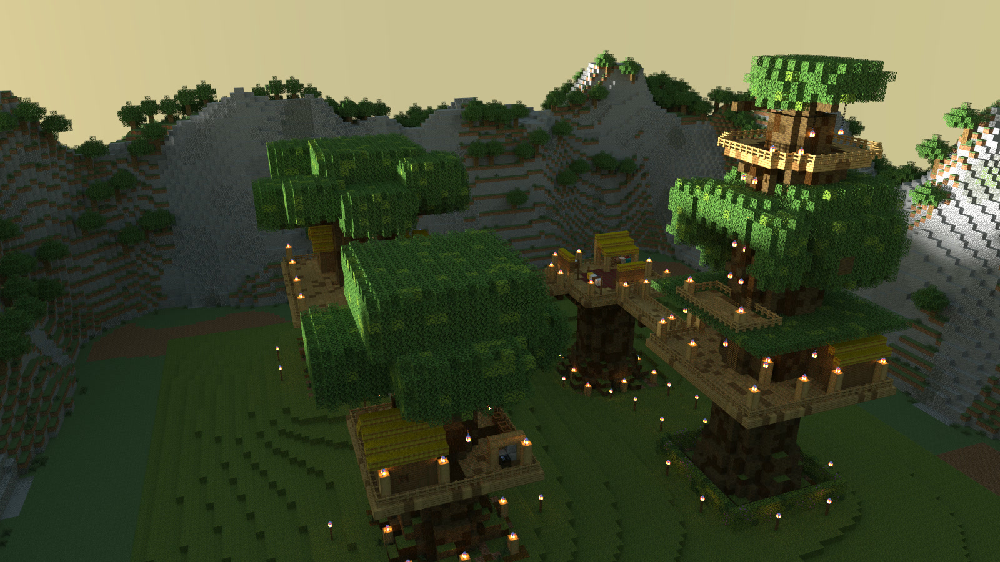

# Inside The Treehouse Camp

Renders of **The Treehouse Camp**, a delve built with Delvewright: a forest clan's houses on four giant trees, joined by rope bridges and rope ladders, at sunset; the last picture is taken at night, after the lantern is hung. The whole camp first, then one picture for each part of it, in the order a party reaches them. [All campaigns](../README.md) · [Back to the front page](../../../README.md).

The camp from high in the south-south-west at sunset: the Seed Tree in front, the Hearth Tree on the left, the Loom House on its cut-off trunk behind, and the Watch Tree on the right, its lookout above every other crown.

---

These are renders of original content built by the engine, shown with Minecraft's textures, and shared under [Mojang's usage guidelines](https://www.minecraft.net/en-us/usage-guidelines) for screenshots.
