# Inside The Treehouse Camp

Renders of **The Treehouse Camp**, a delve built with Delvewright: a forest clan's houses on four giant trees, joined by rope bridges and rope ladders, at sunset; the last picture is taken at night, after the lantern is hung. The whole camp first, then one picture for each part of it, in the order a party reaches them. [All campaigns](../README.md) · [Back to the front page](../../../README.md).

The camp from high in the south-south-west at sunset: the Seed Tree in front, the Hearth Tree on the left, the Loom House on its cut-off trunk behind, and the Watch Tree on the right, its lookout above every other crown.

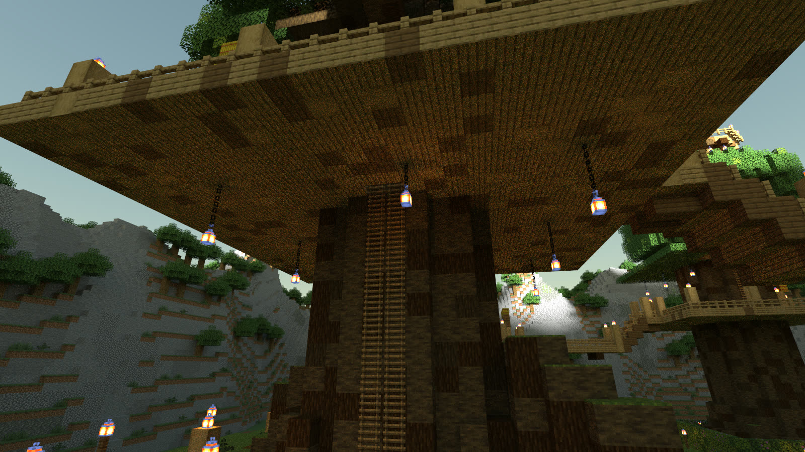

The Root Glade, where the party arrives: the rope ladder up the Hearth Tree's bark to the underside of the Hearth House, lanterns hanging on chains below the platform.

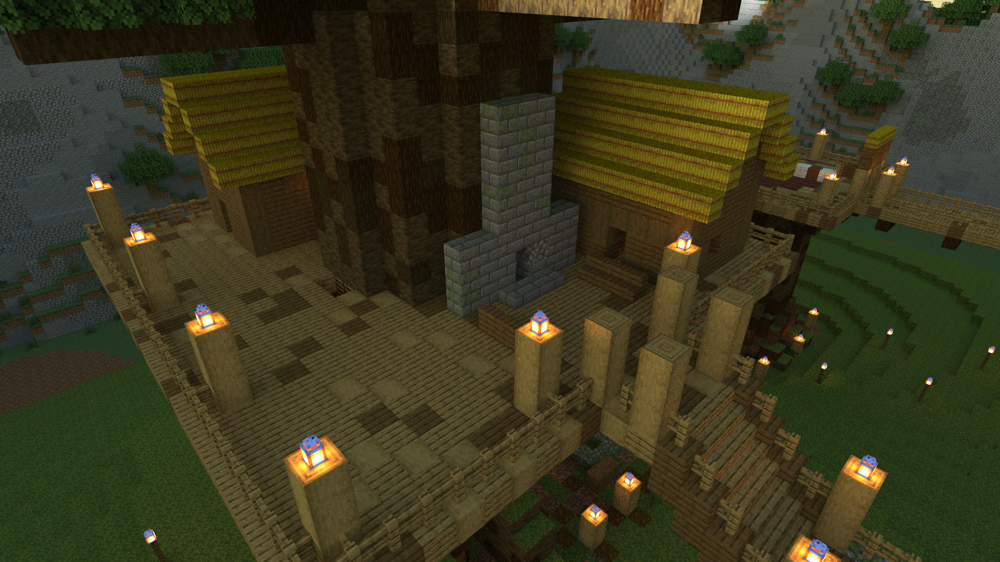

The Hearth House, the highest house in the camp: the stone hearth against the trunk, two thatched cabins, the lantern-topped rail, and the Low Bridge stepping down at the lower right.

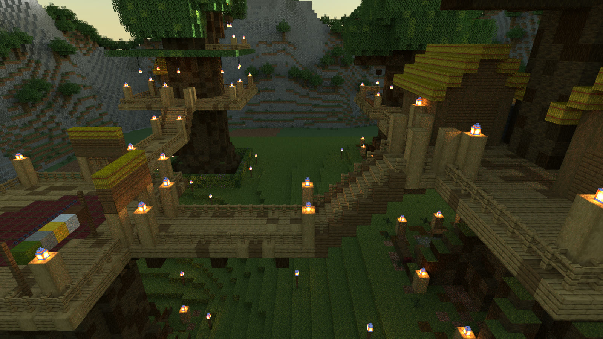

The Long Bridge from the north: it runs from the Loom House on the left and climbs by plank steps to the Hearth House on the right, with the Watch Tree beyond.

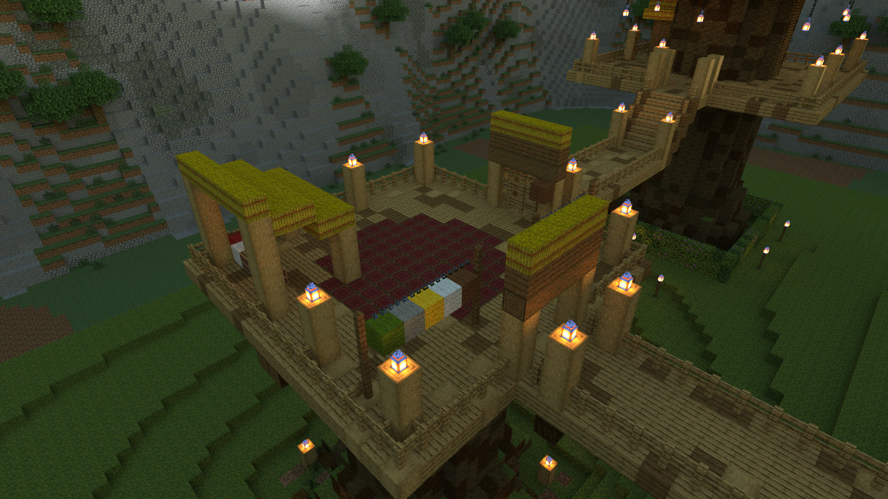

The Loom House on the flat top of a cut-off tree, open to the sky: thatched lean-tos, a red rug and bolts of cloth on the boards, the Long Bridge leaving at the lower right, and the Watch Tree behind.

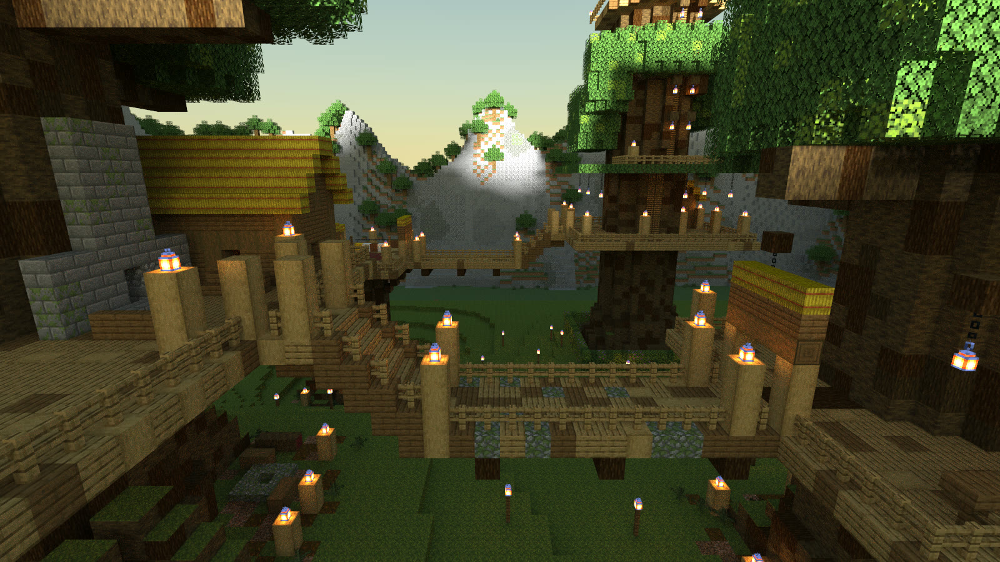

The Low Bridge: from the Hearth House on the left it steps down and runs across to the Seed House on the right; the Watch Tree stands in the distance.

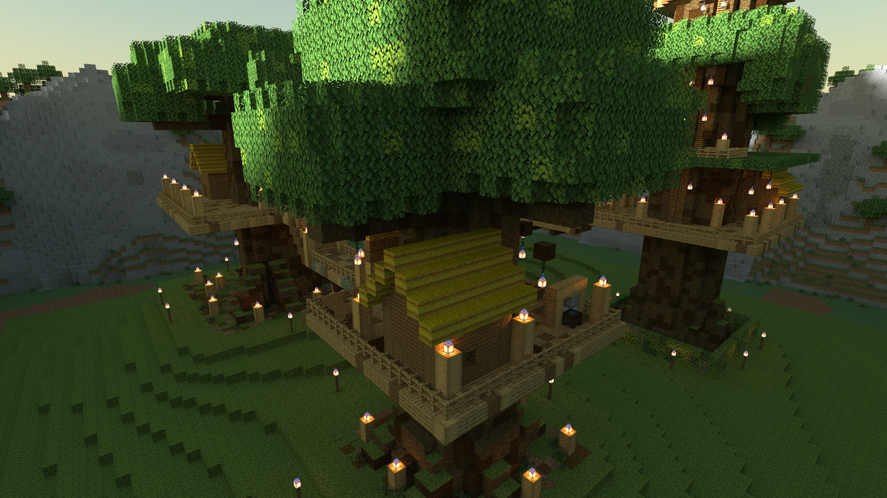

The Seed House under the Seed Tree's broad crown: a thatched hut, the nut press's hanging weight beside it, and the Hearth Tree and the Watch Tree behind.

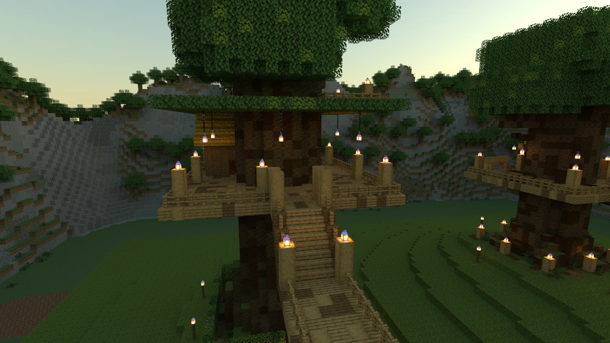

The High Bridge seen from the Loom House end: its plank steps climb to the Watch House platform under the Watch Tree's crown.

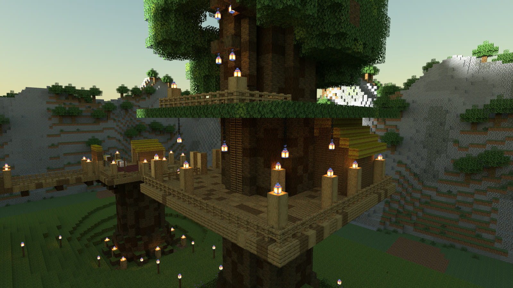

The Watch House: the platform round the Watch Tree's trunk, the sentry hut, lanterns hanging under the leaves, and the rope ladder going up the bark into the crown; the Loom House is in the distance on the left.

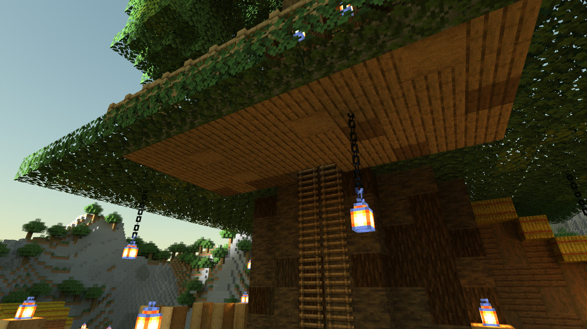

The climb: on the Watch House deck, the rope ladder runs up the Watch Tree's bark through the roof and into the leaves, toward the top of the tree.

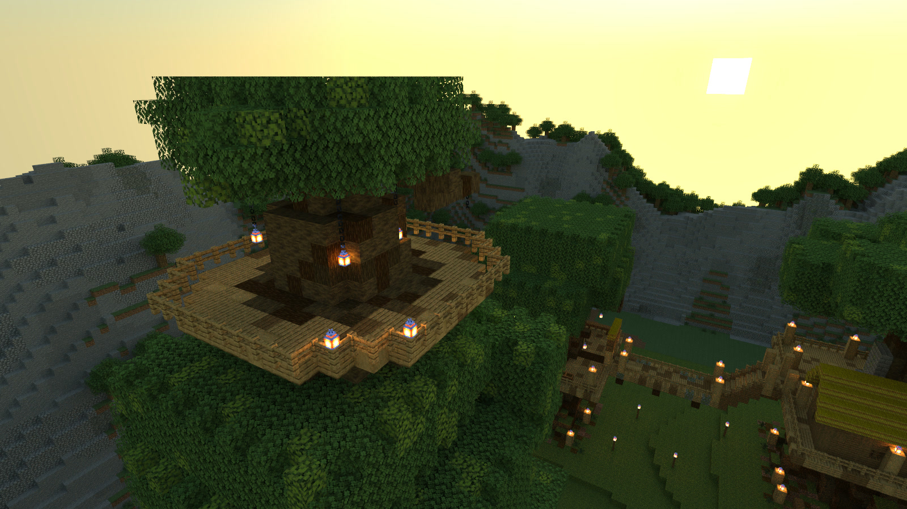

The Crown Lookout: the ring of planks round the top of the Watch Tree, above every other crown in the camp, with the sun going down behind the forest.

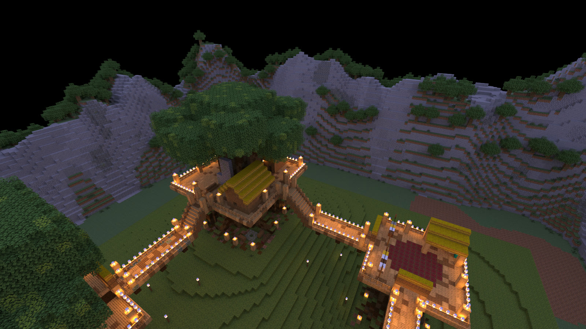

Lantern Night, after the party hangs the new lantern at the top of the Watch Tree: seen from above the lookout, every rail and bridge in the camp is outlined in lanterns in the dark. The Hearth House is in the middle, the Long Bridge runs to the Loom House on the right, and the Low Bridge runs down on the left.

---

These are renders of original content built by the engine, shown with Minecraft's textures, and shared under [Mojang's usage guidelines](https://www.minecraft.net/en-us/usage-guidelines) for screenshots.
