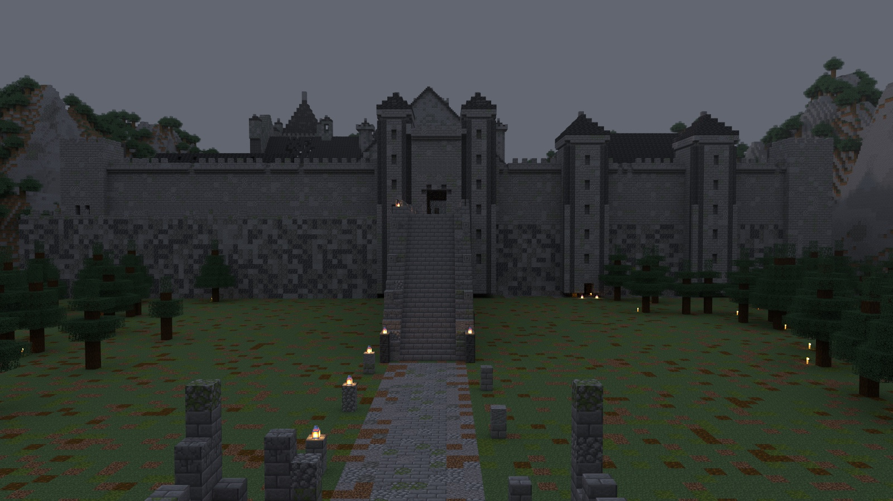
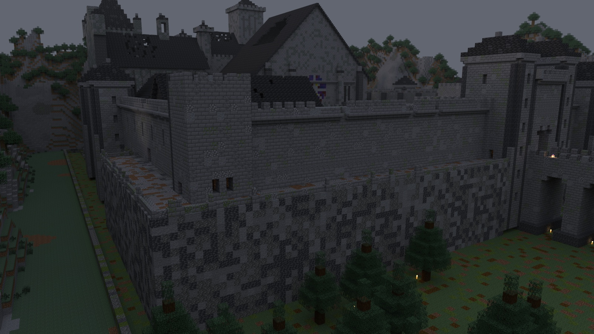
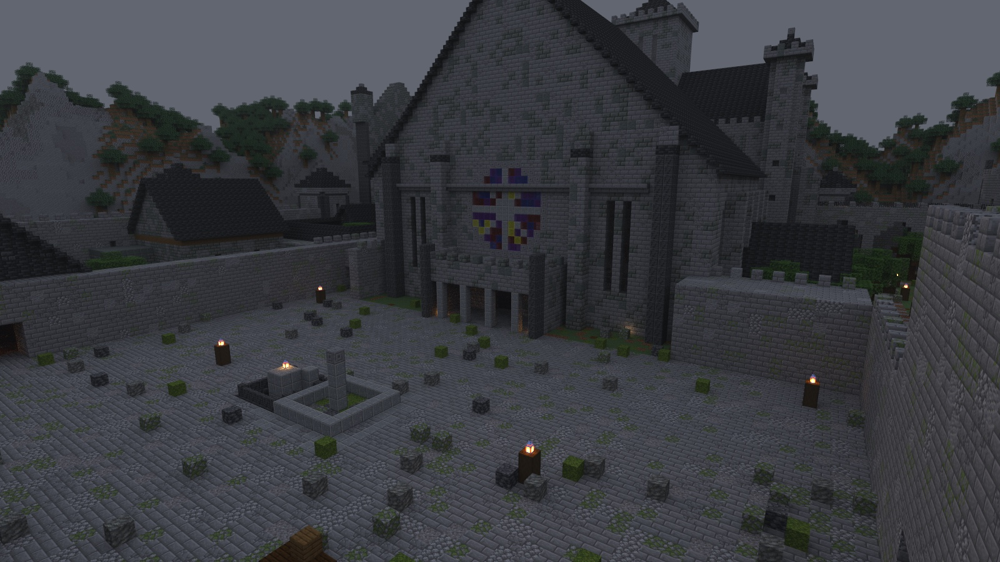
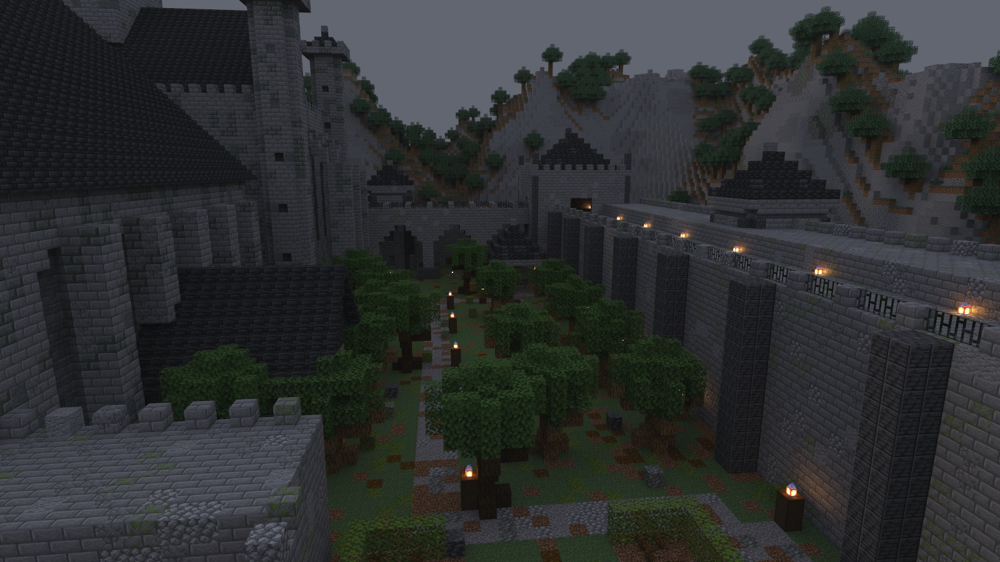
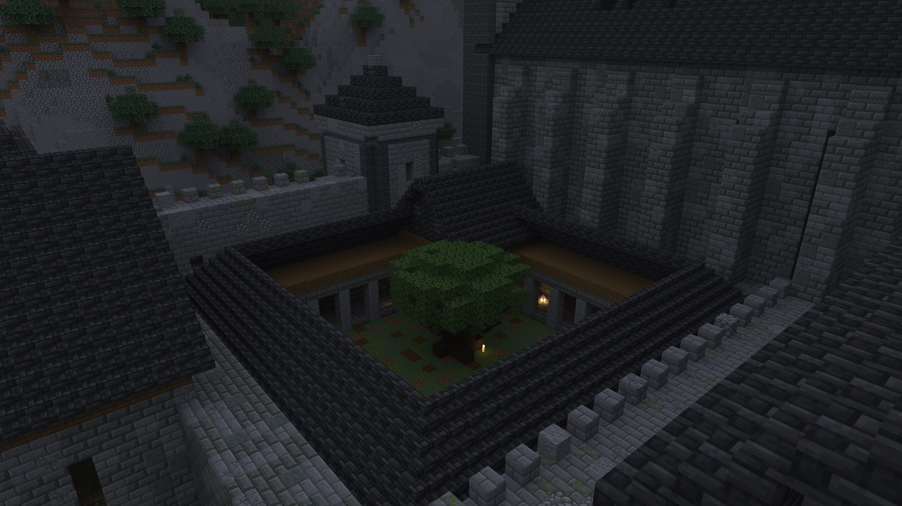
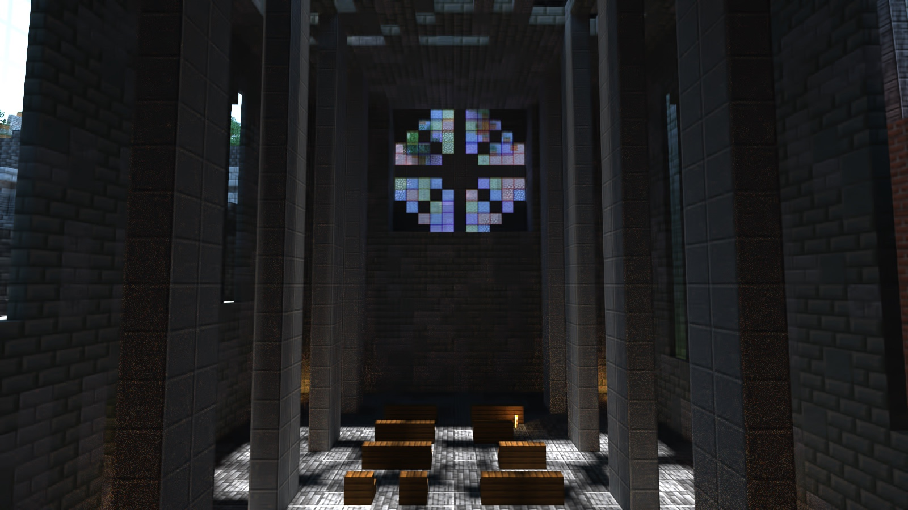
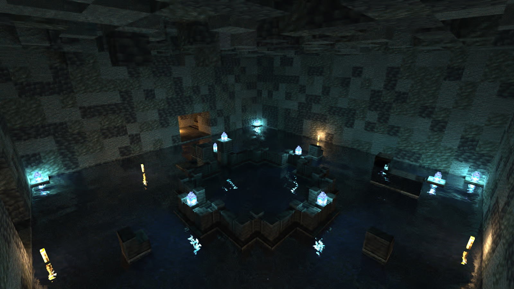
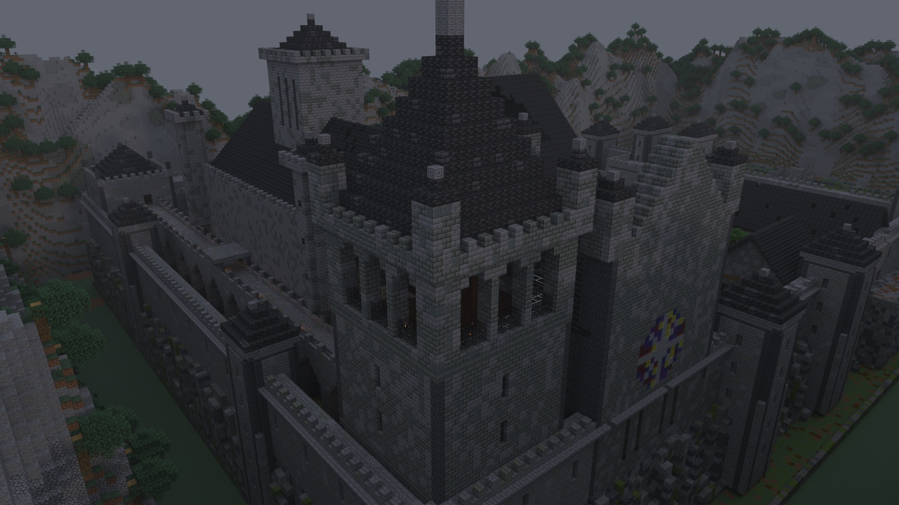
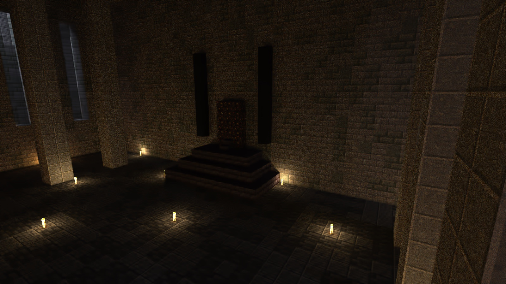

# Inside Vesperhold

Renders of **Vesperhold**, a delve built with Delvewright: a Gothic hold on a crag, at dusk, under rain; one room is shown by day, and its caption says so. One picture for each part of the map, roughly in the order a party reaches them. [Back to the front page](../../../README.md).

The approach: the broken walls of the wayside shrine, the road across the valley floor, and the causeway stair climbing to the gatehouse in the curtain wall.

The south-west corner of the hold: the curtain standing on its crag, and the narrow ledge that runs along the foot of the wall toward the stables.

The outer ward: cracked paving strewn with rubble, a walled pit in the stones, and the great hall's gable with its round window above the porch.

The hedge garden behind the keep: an overgrown orchard between the keep and the east curtain, and the lamp-lit wall walk running north to the watch tower.

The cloister from above: one tree in the garth, the arcades around it, the well-house in the corner, and the buttressed flank of the chapel.

The Chapel of Hours, shown by day: noon light falling through the broken roof onto the pews, and the rose window glowing in the west front.

The undertide pool, under the cloister: the grey well in its stone curb, lanterns burning pale around the flooded floor.

The bell tower from above the north-west corner: the open belfry under its spire, the high walk along the north wall, and the chapel's round window.

The throne hall: the throne on its stepped dais between two dark banners, candles on the floor, and tall narrow windows behind the pillars.

---

These are renders of original content built by the engine, shown with Minecraft's textures, and shared under [Mojang's usage guidelines](https://www.minecraft.net/en-us/usage-guidelines) for screenshots.
