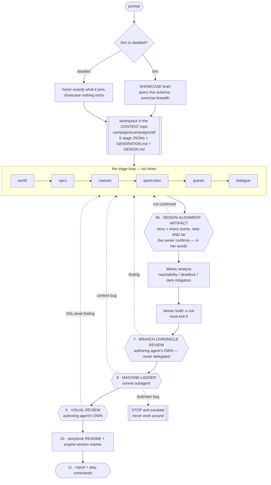
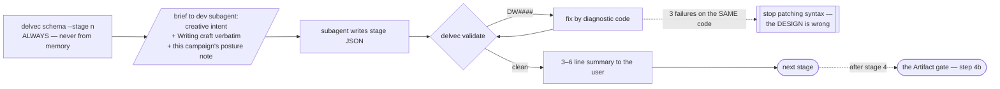

# `/new-delve` — the workflow as it exists today

**Audience: internal (agents, planner).** Model tiers, subagent dispatch and
pipeline plumbing are in scope here and nowhere player-facing (CLAUDE.md,
audience separation). This is a **current-state record**, the same class as
`compiler.md` — it describes the skill that is checked in at
`.claude/skills/new-delve/SKILL.md` today, not the one we intend to build.

Two things it is deliberately not: a spec (nothing here is a decision being
proposed) and a tutorial (a creator never reads it).

---

## 1. The whole run on one screen

The dotted edges are the point of the diagram. Every gate's failure path goes
**back into the DSL**, never into the output: no hand-edited mcfunction, no
patched `.nbt`, no weakened check, no rerolled seed (CLAUDE.md debug doctrine).
The one path that does not loop back is a toolchain bug, and it stops content
work entirely.

## 2. Who does what

| Role | Model | Owns |
|---|---|---|
| **authoring agent** (main) | session model | theme, beats, personas, quest-plan intent, stage summaries, **all user interaction**, the branch chronicle review, visual judgment |
| **dev subagent** | `opus` | the mechanical write of each stage's JSON + the `delvec validate` repair loop |
| **test subagent** | `sonnet` | the machine ladder (step 8) — keeps long server logs out of the authoring context |

One hard rule on top: **a subagent never runs a higher tier than the main agent.**
Main on `sonnet` clamps every subagent to `sonnet`.

Two steps are explicitly non-delegable, for the same reason in both cases —
delegating them would hand the design's intent to somebody who never held it:

- **Step 4b, the design-alignment Artifact.** It exists to put the design in front
  of the owner in the medium she reviews in; a subagent that never held the
  design cannot compose that walkthrough.
- **Step 7, the branch chronicle review.** Narrative judgment against `DESIGN.md`.
- **Step 9, visual review.** Judging a frame is the whole task.

## 3. Inside one stage

`schema --stage <n>` first, every time, is what keeps a stage from being written
against a DSL surface that has since moved. The three-strikes rule on one
diagnostic code is the loop's own anti-thrash guard.

## 4. What each gate actually proves

The value of this table is the right-hand column. A gate that is trusted for
something it does not check is how a green run ships a broken delve.

| # | Gate | Proves | Does **not** prove |
|---|---|---|---|
| 4b | design-alignment Artifact | that the owner has seen the design **in the medium she reviews in** — the whole story, every scene, near view and far — and said yes. The images at *this* gate are **reference images**: concept art drawn from the scene description before any prefab exists, optionally by `tools/refimg.py`. A render is a candidate prefab imaged by `delve-render`, and belongs to curation later. **The approved images are then committed to `campaigns/<id>/design/`** with the approval date and the approved names | nothing, if it was built from orbit renders. "Is the set pretty" is a different question from "what does a player walking in experience". And **nothing at all in a later session, if the approval was never persisted**: `refimg` writes to a gitignored directory, so an approval left in a published page is unreachable by every round that follows it — which is how a whole campaign round got authored against no design and had to be abandoned |
| 5 | `delvec analyze` | the quest graph is reachable, no deadlock, darkness is mitigated | that any of it is *good* |
| 6 | `delvec build` | the DSL compiles to a datapack | nothing about play |
| 7 | branch chronicle | every branch's storyline is coherent **in sequence**, and every branch-divergent dialogue line is licensed by a chronicle line, cited by number in `GENERATION.md` | anything on a branch with no rows — an empty table is a **fail**, not a pass |
| 8 | machine ladder | PackTest green; the bot completes the critical path; it survives `die-retry`; every declared branch was walked | that any fight was measured — read `floor_gate`. `covered`/`not_covered`/`actors[]` **all empty** means no body declares a tier and the gate examined nothing. The island sat in exactly that state, green, for nineteen rounds |
| 9 | visual review | the frame matches the shot's `expect` — **read the POV sequence in route order first**, orbit renders second | `DW0308` proves a camera path is air, not that the shot points at the subject — round 6 shipped an inside-out cinematic that was fully DW-green |
| 10 | storybook marker | the host is told which engine they need | verified by `tools/check-storybook-version.py`, which is the thing that stops a stale marker |

Step 7 exists because of the **decompilation principle** (spec-0025): the
compiler renders the compiled DSL *back into natural language*
(`out/validation/branch-chronicle-<branch>.md`), and the review compares like
with like — NL against NL. Nobody mentally compiles DSL.

### The rule the three judgment gates share

Each renders **compiled reality back into the reviewer's own medium**, and the
review compares like with like: prose against prose for the chronicle, frames
against the walk for the visual tier, a scene walkthrough against the design for
the Artifact. The test to apply before adding any review step — *what does the
compiler emit that shows the reviewer the compiled reality in their medium?* If
the answer is "they read the DSL", the step is designed wrong, because nobody —
model or human — reliably compiles DSL in their head.

The same rule has a second edge: **a structural device enters a campaign only
behind a green machine gate.** Never
author it now and prove it later. The owner's QA hour is the scarce resource
this pipeline exists to protect, and an unproven device spends it on something a
test should have caught. A design wanting a device whose gate does not exist is
a capability gap, reported as one.

## 5. Artifacts of record

Generated campaigns live in the **content repo**, never here (CLAUDE.md
forbidden zone). `campaigns/` is a symlink to `../delvewright-campaigns/`.

| File | What it is |
|---|---|
| six stage JSONs — plus the optional stage-7 `world-edits.json` whenever the map editor was used (the island ships one), and the optional map-pipeline documents a campaign planned as a whole map carries (`geometry-brief.json`, `layout-graph.json`, `site-plan.json`); `delvec validate` covers every stage document a campaign directory holds | **the artifact of record** — the delve must rebuild byte-identically from them with no LLM (ADR-0006/0012) |
| `DESIGN.md` | the single authoritative design document; every round conformance-reviews against it |
| `GENERATION.md` | prompt verbatim, date, `dsl_version`, decisions, the **posture note**, the chronicle citation table, the **findings ledger** |
| `README.md` | the storybook — reader-facing, background only, opens with the engine-version marker |

### A campaign whose map is a site plan

**The whole map is confirmed on a reference before it is composed**, and that is
the first act, not a preliminary: a composition program written without one has
no criterion to be judged against. The reference is **several single full-frame
views of the one subject, generated in sequence** — never one canvas cut into
panels, which spends most of its resolution on gutters and makes one bad panel
cost the whole sheet. View 1 comes from the prompt alone and is confirmed for
style; every later view is generated from the prompt plus **view 1**, anchored on
it by interaction id, never on the view before it, since chaining view to view
compounds drift rather than bounding it. Each view is framed for what it shows,
per call. The trade is stated where the step is: co-generating views in one
canvas guaranteed they agreed about *geometry*, and sequential generation
guarantees only *style*, so the geometric facts live in the written brief below
and a drift is checked against text. Confirmed views and their sidecars are
committed to `campaigns/<id>/design/reference/`.

Such a campaign then writes **three documents the six-stage loop does not have**,
and the skill carries the pipeline as a workflow step rather than as a note: a
`geometry-brief` (the whole's written design reduced to checkable numbers), a
`layout-graph` (the space as places and connections, before any coordinate
exists) and a `site-plan` (the geometric embedding, and the whole map's design of
record). They are authored in that order and the order is not advice — a plan
validates only against a graph and a brief, and there is no blockout document at
all, so no later stage can reach green first. The geometry is derived by
`delvec build`, which also runs the battery over the bytes it laid.

`tools/check-skill-version.py` binds this in the direction that actually drifts:
every campaign stage document the engine defines must be named in the skill, with
`Stage::name` as the denominator. Every other gate on that pair asks whether the
skill's claims are real; this one asks whether the engine's surfaces are driven,
which is the question a skill written once and an engine that keeps moving needs
somebody to ask.

A campaign has **one placement authority**. The usual one is `areas[]`, which
seats prefab pieces; a campaign planned as a whole map hands the space to its
site plan instead, and then three things about the six stage JSONs are different
and none of them is optional:

- **`world.areas` is empty.** Declaring both is refused (`DW0839`) — `areas[]`
  seats pieces on the compiler's fixed stride and the plan seats the derived
  blockout in its own region, so a world with both has two answers to every
  question about where something is.
- **The campaign's one area is `area/site`.** NPCs stand in it and planned
  quests belong to it; there is no other.
- **Content binds to anchors nobody authored.** The blockout is derived, so
  there is no prefab metadata to name an anchor: the derivation synthesizes one
  per place (`anchor/node-<place>`), a gate region over every barred connection
  (`anchor/seam-<edge>`), the far-side affordance's footing on a one-sided one
  (`anchor/unlock-<edge>`), and the campaign's `spawn`. Those are the names to
  write, and validation resolves against exactly the set the derivation places.
  Every barred connection must be opened by something naming its seam
  (`DW0818`).

Nothing else about authoring changes: the quest, gate and shortcut surfaces are
the ones every other campaign uses, and they do not know the difference.

**The numbers such a campaign is built to are the metrics table's**, and they are
provisional until the metrics gym has been walked — every build says so
(`DW0813`). `delvec metrics --gym <dir>` generates that gym: a site-plan campaign
built from the table itself, and the only artifact a walk can calibrate the
standard on. It reports what the table defines that it instantiates nothing of
(`DW0840`), against the whole table, so a standard nothing can be built from is
visible rather than assumed walked.

## 6. Tools come in two classes

The class decides how a tool enters this file:

- **LLM-facing tools are workflow steps, not options.** Where the skill says
  "always", skipping it is skipping validation.
- **Human-in-the-loop tools are offered, never required.** One line at the right
  moment saying the tool exists and what it would catch — then keep going. Never
  block, never wait for a use/don't-use answer.

The skill indexes them **by symptom**, not by name, so an agent reaches for one
without knowing it exists. The full inventory is `docs/reference/tools.md`.

## 7. Rounds

Generation is round 1. Everything after is an iteration round, and the rules are
in `docs/reference/playtest-methodology.md`. The load-bearing ones:

Plus: **audit the full ledger from round 1** before staging any build — never
from the last round only.

## 8. Where this workflow is still hand-carried

Recorded now, while the bell remake is running the loop for the second time,
because that is what the rewrite will consume. Not a proposal — an inventory.

1. **Steps 7 and 9 are judgment, and the skill can only tell an agent to look.**
   Everything else has a machine behind it. These two have a checklist.
2. ~~**The Artifact gate is not in the skill yet.**~~ **Closed 2026-08-06** — it
   is step 4b, mandatory, and it does not relax in e2e mode. What remains
   hand-carried is the *building* of the Artifact: assembling the story and the
   near/far frames is still the authoring agent's own composition, with no
   template and nothing checking that every scene actually got a pair of images.
   `tools/refimg.py` draws the individual reference image, and the multi-view
   sequence a whole subject needs is a workflow step with its anchor and its
   per-view frame written down — but it needs a human iterating on the prompt,
   and it composes nothing.
3. **Chunky is a separate process, not wired into CI** — storybook art is a
   two-pass manual flow (`delvec snapshot` to judge layout, Chunky for the
   shipped frame).
4. **The ladder's project id is chosen by hand** (`dw-<campaign>-r<round>`).
   Required everywhere, defaulted nowhere — deliberately, since a shared default
   is what the mutex used to paper over.
5. ~~**ADR-0016's third version line is undelivered.**~~ **Closed** — the
   frontmatter carries `version: 1.1.0`, `requires: delvec: ">=1.0.0 <2.0.0"`
   and `verified_with: 1.1.0`, and `tools/check-skill-version.py` binds all
   three: the window must contain this repo's engine, `verified_with` must equal
   `crates/compiler/Cargo.toml`'s version in **both** directions, and every
   subcommand and long flag the skill names must exist in the clap CLI (today:
   9 distinct subcommands, 13 flag references). What is still hand-carried is a
   floor that has become **too low** — the gate tests the skill against the
   CURRENT CLI, so a subcommand introduced after the declared floor still
   passes, and this repo has only one engine to test against.
