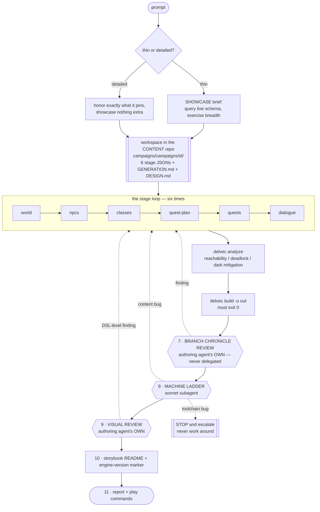
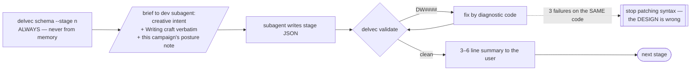
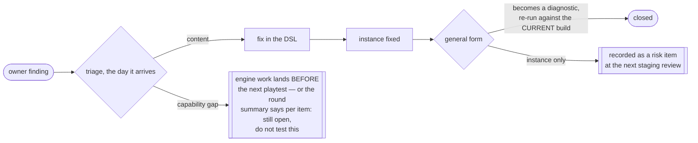

# `/new-delve` — the workflow as it exists today

**Audience: internal (agents, planner).** Model tiers, subagent dispatch and
pipeline plumbing are in scope here and nowhere player-facing (CLAUDE.md,
audience separation). This is a **current-state record**, the same class as
`compiler.md` — it describes the skill that is checked in at
`.claude/skills/new-delve/SKILL.md` today, not the one we intend to build.

Two things it is deliberately not: a spec (nothing here is a decision being
proposed) and a tutorial (a creator never reads it).

---

## 1. The whole run on one screen

The dotted edges are the point of the diagram. Every gate's failure path goes
**back into the DSL**, never into the output: no hand-edited mcfunction, no
patched `.nbt`, no weakened check, no rerolled seed (CLAUDE.md debug doctrine).
The one path that does not loop back is a toolchain bug, and it stops content
work entirely.

## 2. Who does what

| Role | Model | Owns |
|---|---|---|
| **authoring agent** (main) | session model | theme, beats, personas, quest-plan intent, stage summaries, **all user interaction**, the branch chronicle review, visual judgment |
| **dev subagent** | `opus` | the mechanical write of each stage's JSON + the `delvec validate` repair loop |
| **test subagent** | `sonnet` | the machine ladder (step 8) — keeps long server logs out of the authoring context |

One hard rule on top: **a subagent never runs a higher tier than the main agent.**
Main on `sonnet` clamps every subagent to `sonnet`.

Two steps are explicitly non-delegable, for the same reason in both cases —
delegating them would hand the design's intent to somebody who never held it:

- **Step 7, the branch chronicle review.** Narrative judgment against `DESIGN.md`.
- **Step 9, visual review.** Judging a frame is the whole task.

## 3. Inside one stage

`schema --stage <n>` first, every time, is what keeps a stage from being written
against a DSL surface that has since moved. The three-strikes rule on one
diagnostic code is the loop's own anti-thrash guard.

## 4. What each gate actually proves

The value of this table is the right-hand column. A gate that is trusted for
something it does not check is how a green run ships a broken delve.

| # | Gate | Proves | Does **not** prove |
|---|---|---|---|
| 5 | `delvec analyze` | the quest graph is reachable, no deadlock, darkness is mitigated | that any of it is *good* |
| 6 | `delvec build` | the DSL compiles to a datapack | nothing about play |
| 7 | branch chronicle | every branch's storyline is coherent **in sequence**, and every branch-divergent dialogue line is licensed by a chronicle line, cited by number in `GENERATION.md` | anything on a branch with no rows — an empty table is a **fail**, not a pass |
| 8 | machine ladder | PackTest green; the bot completes the critical path; it survives `die-retry`; every declared branch was walked | that any fight was measured — read `floor_gate`. `covered`/`not_covered`/`actors[]` **all empty** means no body declares a tier and the gate examined nothing. The island sat in exactly that state, green, for nineteen rounds |
| 9 | visual review | the frame matches the shot's `expect` | `DW0308` proves a camera path is air, not that the shot points at the subject — round 6 shipped an inside-out cinematic that was fully DW-green |
| 10 | storybook marker | the host is told which engine they need | verified by `tools/check-storybook-version.py`, which is the thing that stops a stale marker |

Step 7 exists because of the **decompilation principle** (spec-0025): the
compiler renders the compiled DSL *back into natural language*
(`out/validation/branch-chronicle-<branch>.md`), and the review compares like
with like — NL against NL. Nobody mentally compiles DSL.

## 5. Artifacts of record

Generated campaigns live in the **content repo**, never here (CLAUDE.md
forbidden zone). `campaigns/` is a symlink to `../delvewright-campaigns/`.

| File | What it is |
|---|---|
| six stage JSONs | **the artifact of record** — the delve must rebuild byte-identically from them with no LLM (ADR-0006/0012) |
| `DESIGN.md` | the single authoritative design document; every round conformance-reviews against it |
| `GENERATION.md` | prompt verbatim, date, `dsl_version`, decisions, the **posture note**, the chronicle citation table, the **findings ledger** |
| `README.md` | the storybook — reader-facing, background only, opens with the engine-version marker |

## 6. Tools come in two classes

Owner ruling, 2026-08-02, and it decides how a tool enters this file:

- **LLM-facing tools are workflow steps, not options.** Where the skill says
  "always", skipping it is skipping validation.
- **Human-in-the-loop tools are offered, never required.** One line at the right
  moment saying the tool exists and what it would catch — then keep going. Never
  block, never wait for a use/don't-use answer.

The skill indexes them **by symptom**, not by name, so an agent reaches for one
without knowing it exists. The full inventory is `docs/reference/tools.md`.

## 7. Rounds

Generation is round 1. Everything after is an iteration round, and the rules are
in `docs/reference/playtest-methodology.md`. The load-bearing ones:

Plus: **audit the full ledger from round 1** before staging any build — never
from the last round only.

## 8. Where this workflow is still hand-carried

Recorded now, while the bell remake is running the loop for the second time,
because that is what the rewrite will consume. Not a proposal — an inventory.

1. **Steps 7 and 9 are judgment, and the skill can only tell an agent to look.**
   Everything else has a machine behind it. These two have a checklist.
2. **The Artifact gate is not in the skill yet.** The bell remake runs
   design + prefabs → Artifact (story + per-scene near/far renders) → owner
   confirms → *only then* DSL. Today that sequence lives in the planner's head
   and in the remake's own design doc.
3. **Chunky is a separate process, not wired into CI** — storybook art is a
   two-pass manual flow (`delvec snapshot` to judge layout, Chunky for the
   shipped frame).
4. **The ladder's project id is chosen by hand** (`dw-<campaign>-r<round>`).
   Required everywhere, defaulted nowhere — deliberately, since a shared default
   is what the mutex used to paper over.
5. **No version contract on the skill itself.** It emits some `dsl_version` and
   needs some `delvec`, and neither is declared or checked. This is what the
   component-scoped tag + manifest-field decision (owner, 2026-08-06) is for.
